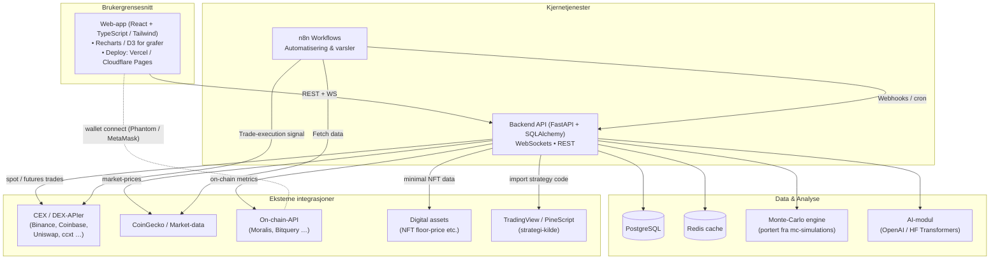
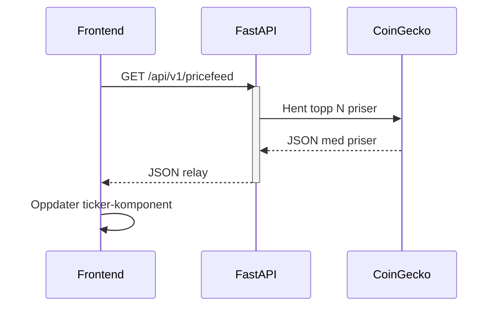
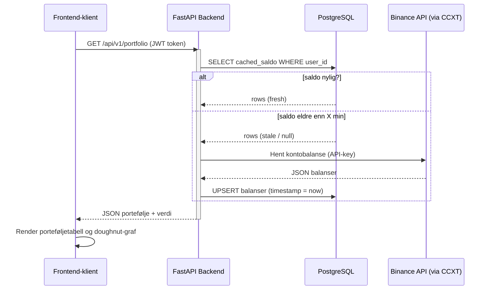
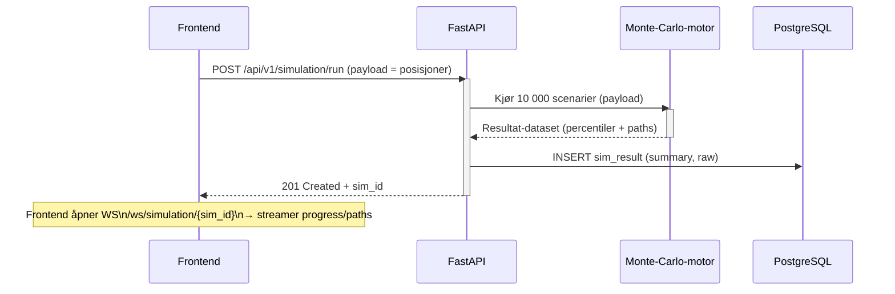
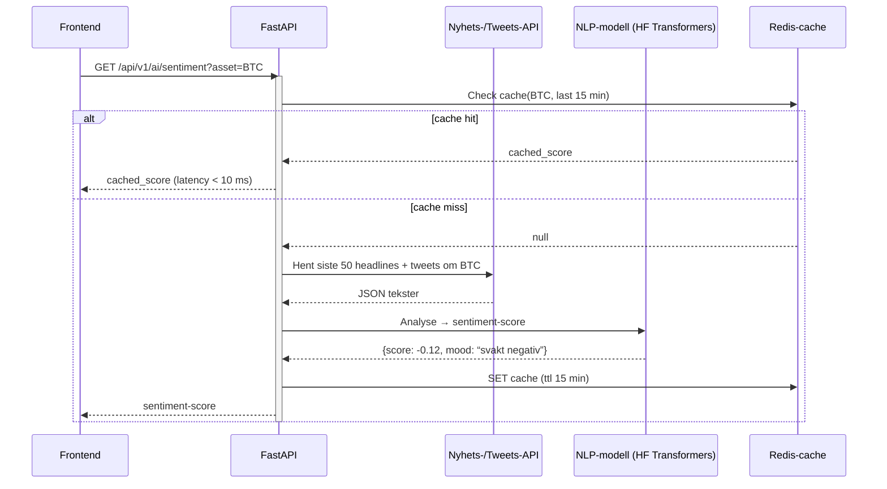
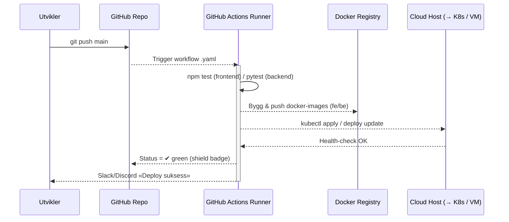
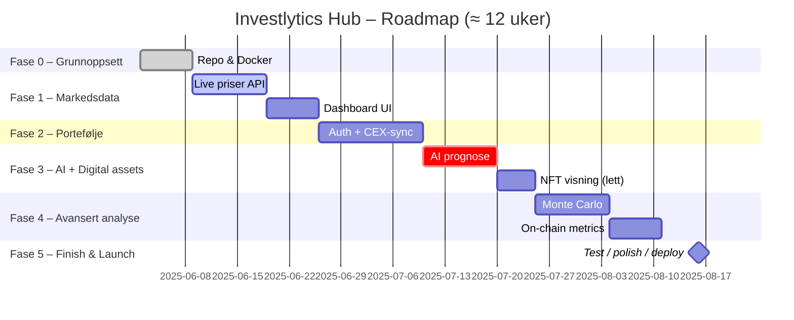
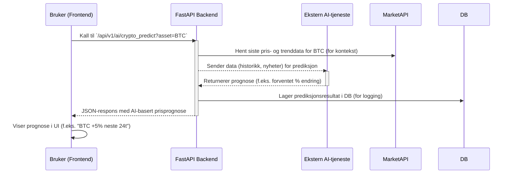

Prosjektplan – Investlytics Hub
============================================


Introduksjon og Målsetninger
----------------------------

Investlytics Hub er en planlagt plattform for kryptoanalyse med **hovedfokus på kryptovaluta-trading, sanntids markedsdata, integrasjoner mot sentraliserte og desentraliserte børser (CEX/DEX)** samt **AI-drevet analyse**. Plattformen skal være et alt-i-ett verktøy der tradere og investorer kan overvåke markedene i sanntid, analysere porteføljer på tvers av børser, og få prediktiv innsikt ved hjelp av kunstig intelligens (AI). I tillegg vil løsningen støtte visning av digitale eiendeler (f.eks. NFT-er) som en valgfri del.

**Hovedmål for Investlytics Hub:**

*   **Sanntids markedsdata:** Aggregere og vise kurser, ordrebok og volum i sanntid fra flere kryptobørser (CEX/DEX) i ett brukergrensesnitt.
    
*   **Trading og porteføljeoversikt:** Tilrettelegge for trading-relatert innsikt – som prisdiagrammer, tekniske indikatorer og personlig porteføljeoversikt på tvers av børser – slik at brukeren kan følge med på egen beholdning og ytelse.
    
*   **CEX/DEX-integrasjoner:** Integrere mot eksterne API-er fra sentraliserte børser (CEX) og desentraliserte børser (DEX) for å hente markedsdata og (etter hvert) støtte handel eller porteføljesynkronisering via API-nøkler/lommebøker.
    
*   **AI-drevet analyse:** Utnytte AI for prediktiv analyse og sentimentanalyse innen kryptomarkedet. For eksempel tilby prognoser om prisutvikling eller stemningsindikatorer basert på nyheter og sosiale medier. (En dedikert API-endepunkt, f.eks. /api/v1/ai/crypto\_predict, skal implementeres for å levere slike AI-baserte innsikter til frontenden.)
    
*   **Støtte for digitale eiendeler:** Inkludere grunnleggende visning av digitale eiendeler (NFT-er) knyttet til brukerens portefølje som en _tilleggsmulighet_. Denne delen holdes enkel i MVP, med potensiale for utvidelse senere, slik at kjernefokuset forblir på kryptotrading og analyse.
    

Prosjektomfang og MVP
---------------------

Denne prosjektplanen omfatter design og utvikling av Investlytics Hub fra konsept til lansering. **Minimumsproduktet (MVP)** vil konsentrere seg om kjernefunksjonene knyttet til kryptotrading og markedsdata, mens mer komplekse eller sekundære funksjoner utsettes til senere faser. Nedenfor presiseres omfanget for MVP vs. senere faser:

*   **Inkludert i MVP:**
    
    *   **Sanntids kursovervåkning:** Live oppdatering av kryptovalutakurser og enkle diagrammer for utvalgte tradingpar.
        
    *   **Markedssammendrag:** Vise nøkkeldata (f.eks. topp 10 kryptovalutaer, markedsverdi, 24t volum) innhentet fra en tjeneste som CoinGecko.
        
    *   **Basis CEX-integrasjon:** Hente data (og eventuelt brukerportefølje) fra minst én sentralisert børs via API (f.eks. Binance eller Coinbase Pro) for å demonstrere konseptet.
        
    *   **Enkel porteføljefunksjonalitet:** La brukeren registrere eller importere sin kryptoportefølje og se totalverdi, fordeling per valuta osv. (Evt. ved å koble en API-nøkkel til en børs for å hente balansen automatisk, eller manuelt legge inn beholdning).
        
    *   **AI-drevet innsikt (grunnleggende):** Integrere en første versjon av AI-analyse, f.eks. en prisprognose for en valgt kryptovaluta eller en enkel sentimentanalyse basert på nyhetsheadlines. Dette leveres via et API-endepunkt på backend (f.eks. /api/v1/ai/crypto\_predict) som benytter en forhåndstrent modell eller tredjeparts AI-tjeneste.
        
    *   **Visning av digitale eiendeler (NFT-er):** MVP’en vil inkludere mulighet for brukeren til å se en enkel oversikt over sine digitale eiendeler (f.eks. NFT-er) – for eksempel en liste over NFT-er knyttet til brukerens lommebok eller pNFT-prosjekt – men uten avansert funksjonalitet (kun visning av navn/bilde og eventuell verdi). Denne delen implementeres kun dersom tid tillater, og i så fall som en isolert modul slik at den ikke påvirker resten av systemet om den må deaktiveres.
        
*   **Utenfor MVP / fremtidige faser:**
    
    *   **Avanserte NFT-funksjoner:** Kjøp/salg av NFT-er, minting, full integrasjon med markedsplasser eller kompleks gallerivisning er utelatt fra MVP. Slike _digitale eiendel_\-funksjoner kan vurderes i senere faser dersom det blir prioritert, men MVP holder det på et minimum (kun enkel visning).
        
    *   **Flere børsintegrasjoner og handel:** Selv om MVP kobler til minst én børs for data (og eventuelt portefølje), vil støtten for **flere** CEX-er og desentraliserte børser (DEX-er) samt faktisk handelsutførelse via API (plassere kjøp/selg-ordrer) bli bygget ut gradvis etter MVP. Initialt fokuserer vi på datainnhenting og analyse, mens ordreutførelse og kompleks kontohåndtering på tvers av mange børser tas i senere faser.
        
    *   **Utvidet AI og modelltrening:** Eventuell utvikling av egne AI-modeller som krever trening på store datamengder, tuning av prediksjonsmodeller spesielt for kryptomarkedet, eller dyp integrasjon av sentimentanalyse (f.eks. analyse av Twitter i sanntid) vil bli utført etter MVP. I første omgang bruker vi eksisterende modeller og tjenester for å levere AI-funksjonalitet raskt.
        
    *   **Andre utvidelser:** Omfattende funksjoner som automatiserte trading-strategier, porteføljeoptimalisering, skattekalkulasjoner, eller mobilapp-utvikling (egen native app) er foreløpig utenfor MVP og nevnes som mulige oppfølgningsprosjekter senere.
        

Ved å avgrense omfanget som over sikrer vi at MVP leverer verdifull funksjonalitet raskt, samtidig som arkitekturen utformes med tanke på fremtidige utvidelser (AI-forbedringer, flere integrasjoner, digitale eiendeler etc.). Neste seksjoner beskriver arkitekturen og utviklingsplanen i detalj, tilpasset disse prioriteringene.

Arkitektur
----------

Den oppdaterte arkitekturen for Investlytics Hub er designet for å støtte sanntidsdata, eksterne integrasjoner og AI-analyse innenfor en modulær og skalerbar struktur. Løsningen følger en klient-tjener-modell med en webbasert frontend og en Python-basert backend. Backend tilbyr et REST API (samt WebSocket for sanntidsoppdateringer) som frontenden (og eventuelle andre klienter) bruker. I tillegg er det integrasjon mot eksterne datakilder (børs-APIer, on-chain APIer, AI-tjenester). Hovedkomponentene er:

*   **Frontend:** En webklient (single-page application) skrevet i et moderne rammeverk (f.eks. React) som kjører i nettleser. Denne kommuniserer med backend over HTTPS (REST API for forespørsler/response og WebSocket for løpende oppdateringer). Frontend-en presenterer dashbord, grafer, porteføljeinformasjon og AI-innsikter til brukeren i sanntid. (Eventuell mobilapp i fremtiden kan bruke de samme API-ene.)
    
*   **Backend API:** En serverapplikasjon skrevet i Python ved hjelp av FastAPI, som håndterer forretningslogikken. Backend tilbyr ulike moduler/endepunkter:
    
    *   **Marked/Trading-modul:** Henter sanntids markedsdata fra eksterne kilder (CEX/DEX APIer, CoinGecko m.fl.), prosesserer dem (f.eks. beregne indikatorer), og leverer til frontend. Kan inkludere WebSocket-endepunkter for push av live kurser.
        
    *   **Porteføljemodul:** Tar seg av alt relatert til brukerens portefølje – lagring av hvilke aktiva brukeren eier, innhenting av oppdatert verdi (pris) for disse, integrasjon mot brukerens konto på børser via API-nøkler (for automatisk oppdatering av beholdning), og eventuelt henting av brukerens **digitale eiendeler (NFT-er)** via en on-chain data API.
        
    *   **AI-modul:** Står for AI-drevet analyse, som prediktiv modellering og sentimentanalyse. Denne modulen kan kalle ut til tredjeparts AI-tjenester (f.eks. OpenAI API eller HuggingFace pipeline) eller bruke lokale forhåndstrente modeller for å generere prognoser. Resultatene eksponeres gjennom egne endepunkter (f.eks. /api/v1/ai/crypto\_predict) som frontend kan benytte for å vise AI-insikt.
        
    *   **Database lagring:** En database (f.eks. PostgreSQL) for lagring av vedvarende data – brukerkontoer, porteføljeopplysninger, historiske data som er nødvendige for analyser (f.eks. lagrede priser for å kjøre simuleringer) og eventuelle logger. Databaseabstraksjon håndteres via et ORM eller queries direkte i Python.
        
    *   **Autentisering og sikkerhet:** Håndtering av brukerpålogging, API-nøkler og tilgangskontroll. For eksempel kan JSON Web Tokens (JWT) benyttes for å sikre API-ene, og sensitive nøkkelverdier (børs-API-nøkler, etc.) krypteres i databasen.
        
*   **Eksterne integrasjoner:** Backend vil kommunisere med en rekke eksterne tjenester:
    
    *   **CEX APIer:** for å hente markedsdata (priser, orderbok) og brukerdata (balanser, transaksjoner) fra sentraliserte børser. Et bibliotek som CCXT kan brukes for å standardisere integrasjon mot mange børser.
        
    *   **DEX/on-chain data APIer:** for å hente on-chain informasjon, som token-beholdninger i en lommebok, transaksjoner på blokkjeden og NFT-data. Her planlegges bruk av tjenester som **Moralis** eller **Bitquery** som forenkler uthenting av blokkjede-data via API. Disse vil være viktige spesielt for porteføljefasen (Fase 4) der on-chain analytics inngår.
        
    *   **Markedsdata-aggregatorer:** f.eks. **CoinGecko API** for generelle kryptodata (priser, markedsverdi, historikk) som supplement til direkte børsintegrasjoner.
        
    *   **AI-tjenester:** f.eks. **OpenAI API** for å utføre språkbasert analyse (som nyhetssentiment) eller til og med for å generere prisprediksjoner basert på trenede modellert, samt mulighet for å integrere **HuggingFace-modeller** for sentimentanalyse av sosiale medier. Hvis nødvendig kan et ML-rammeverk som PyTorch brukes bak kulissene, men i første omgang benyttes eksterne AI-tjenester for rask implementering.
        

Arkitekturskisse som illustrerer samspillet mellom frontend, backend og eksterne komponenter:



_Forklaring:_ Frontend-klienten (webappen) kommuniserer med FastAPI-backenden via HTTPS REST-kall for vanlige forespørsler (f.eks. hente porteføljedata) og eventuelt WebSocket for å motta sanntids kurser uten polling. Backenden henter data fra eksterne kilder: direkte fra børsers APIer for live trading-data og brukerens kontoinformasjon, fra on-chain APIer (som Moralis) for f.eks. NFT-oversikt eller transaksjonshistorikk, og fra markedsdata-APIer som CoinGecko for generell info. AI-modulen i backenden kan kalle ut til en AI-tjeneste (OpenAI, etc.) for å få f.eks. en prediksjon, som så sendes tilbake til frontend. Alle disse modulene samhandler med databasen ved behov (lagring av brukerdata, caching av nylige spørringsresultater, historiske priser for analyse etc.).

Arkitekturen er modulær slik at nye datakilder eller moduler (f.eks. flere AI-modeller, flere børser) kan legges til uten store omveltninger. FastAPI-valget gir også automatisk dokumentasjon av API-et (Swagger UI), noe som er nyttig for både utviklere og eventuelle tredjepartsintegrasjoner. Løsningen planlegges containerisert (Docker) for enkel distribusjon, og kan settes opp i skytjenester for skalering ved behov.

Teknologistakk
--------------

Prosjektet vil benytte en moderne teknologistack, valgt for å oppfylle kravene til sanntid, dataintegrasjoner og AI-analyse:

*   **Frontend:** _React_ (JavaScript/TypeScript) for å bygge en responsiv enkelt-side webapplikasjon. React gir god dynamisk grensesnittoppdatering, og har et stort økosystem (f.eks. Redux for state management om nødvendig, og biblioteker for grafer som D3.js eller Chart.js for finansdiagrammer). Alternativt/utfyllende kan rammeverk som _Next.js_ benyttes for server-side rendering om det er behov. Styling gjøres med et UI-bibliotek (f.eks. Material UI eller Tailwind CSS) for konsistente komponenter. (Merk: Andre rammeverk som Angular eller Vue.js kunne også vært brukt; arkitekturen tillater det, men React antas her som preferanse.) For fremtidig mobilstøtte vurderes _Flutter_ eller _React Native_ slik at kode kan gjenbrukes til native-apper, men i første omgang fokuserer vi på en webbasert klient som også fungerer på mobile enheter via responsivt design.
    
*   **Backend:** _Python_ med _FastAPI_ som web-rammeverk. FastAPI gir høy ytelse (basert på Uvicorn/ASGI) og støtter asynkrone operasjoner, noe som er viktig når vi skal gjøre mange I/O-kall mot eksterne API-er samtidig (unngå blocking). Python ekosystemet muliggjør også enkel integrasjon av dataanalyse og AI-biblioteker. Noen viktige bibliotek og verktøy på backend:
    
    *   **FastAPI & Pydantic:** For å definere API-ruter og datastrukturer (Pydantic-modeller) klart og typesikret.
        
    *   **SQLAlchemy eller Tortoise ORM:** For å kommunisere med SQL-databasen på en praktisk måte (modellere bruker, portefølje osv. som Python-klasser).
        
    *   **CCXT:** Bibliotek som støtter et stort antall kryptobørser sine APIer under en felles grensesnitt. Dette vil forenkle implementasjon av CEX-integrasjoner (hente tickere, legge inn ordre, etc.) uten å måtte håndkode hver børs sitt API.
        
    *   **Web3.py eller Moralis SDK:** Ved behov for direkte interaksjon med blokkjeder (for DEX-data eller NFT), kan disse brukes. Alternativt brukes rene HTTP-kall til Moralis/Bitquery APIer om de dekker behovet (f.eks. REST/GraphQL spørringer).
        
    *   **AI/ML-biblioteker:** I første omgang vil vi benytte eksterne AI-tjenester, men Python gir mulighet til å integrere libs som HuggingFace Transformers (for NLP/sentimentanalyse), scikit-learn (for enklere prediktive modeller), eller PyTorch/TensorFlow (for dypere modeller) dersom det blir aktuelt å kjøre egne modeller.
        
    *   **Databehandling:** NumPy, Pandas for håndtering av datasett (f.eks. beregne indikatorer, kjøre simuleringer). For Monte Carlo-simulering kan f.eks. NumPy brukes til å generere mange scenarier. Matplotlib/Plotly kan brukes server-side for å generere grafer om noe skal forhåndsprosesseres, men mest sannsynlig sendes data til frontend for visualisering der.
        
    *   **Andre verktøy:** Uvicorn ASGI server for å kjøre FastAPI, Celery eller APScheduler for bakgrunnsjobber (f.eks. jevnlig hente kursoppdateringer eller nyheter i bakgrunnen), Redis for caching (kan f.eks. cache siste priser eller API-svar for å redusere responstid og belastning på eksterne APIer).
        
*   **Database:** _PostgreSQL_ (foretrukket) som hoveddatabase for lagring av persisterte data. Postgres er robust og godt støttet i Python-miljøet. Alternativt kan en skylagringstjeneste eller NoSQL vurderes for spesielle data (f.eks. historiske pris-ticks i stort volum kunne lagres i en tidsserie-database som InfluxDB, men sannsynligvis holder Postgres eller et cachelag). Brukerdata, porteføljeobjekter og referanser til digitale eiendeler lagres her.
    
*   **Integrasjons-APIer:** Vi benytter tredjeparts API-er for å slippe å håndtere alt selv:
    
    *   _CoinGecko API_ – for fri tilgang til prisinformasjon, markedsoversikter og historiske data uten behov for API-nøkkel.
        
    *   _Børs-APIer_ – f.eks. Binance API for sanntidskurser og brukers portfolio (via API-nøkkel), Coinbase API, Kraken etc., med CCXT for å forenkle bruken. Websocket-feeds fra disse kan også brukes for realtime oppdatering (f.eks. Binance WebSocket for trade ticks).
        
    *   _Moralis_ – for raskt oppsett mot flere blokkjeder; kan gi token- og NFT-balanser for en lommebok, historikk av transaksjoner m.m. via enkle spørringer.
        
    *   _Bitquery_ – for mer avanserte on-chain spørringer via GraphQL, dersom vi trenger dypere blockchain-analyser (f.eks. on-chain volum for en gitt coin, eller spore hvordan midler flytter seg).
        
    *   _OpenAI API_ – for å hente AI-basert analyse, f.eks. la GPT-4 oppsummere sentiment eller predikere ut ifra nyheter. Eller _HuggingFace Inference API_ for å kjøre sentimentmodell på kryptorelaterte tekster. Slike tjenester krever nøkkel og koster per bruk, så de brukes der det gir mest verdi.
        
*   **Utviklingsverktøy og miljø:** Koden versjonshåndteres på _GitHub_. Vi setter opp _CI/CD_\-pipelines (f.eks. GitHub Actions) for å automatisk kjøre tester og kunne deploye til et staging-miljø. Docker brukes for å pakke applikasjonen slik at både utviklingsmiljø og produksjonsmiljø er konsistente. Dokumentasjon håndteres i markdown og genereres evt. med verktøy (se egen seksjon om dokumentasjon).
    

Denne teknologistakken gir et godt utgangspunkt for å dekke alle krav. Valgene vektlegger velprøvde rammeverk med stor brukerbase (lett å finne støtte og utviklere), og tjenester som lar oss implementere avanserte funksjoner (AI, on-chain data) uten å gjenoppfinne hjulet.

Faser og milepæler (Roadmap)
----------------------------

Prosjektet deles inn i klare faser for å sikre strukturert fremdrift. Hver fase har definerte milepæler og leveranser. Under følger en roadmap med faser fra konsept til lansering, inkludert en ekstra dedikert fase (Fase 4) for kryptoporteføljeanalyse som ønsket. Milepæler er uthevet for å markere viktige delmål (f.eks. ferdigstillelse av MVP).

### Fase 0: Konseptualisering og Oppsett 

**Mål:** Legge grunnlaget for prosjektet med klart design, arkitektur og utviklingsmiljø.

*   **Krav og design:** Verifisere kravene (spesielt fokusområdene: trading, sanntidsdata, AI, minimal NFT) og justere opprinnelig plan til ny fokus. Definere use-cases og brukerhistorier for kjernefunksjonene (f.eks. _"Som bruker vil jeg se oppdaterte priser fra flere børser i et dashboard..."_).
    
*   **Arkitekturdesign:** Oppdatere systemarkitekturen (tegn nye diagrammer, definer modul-inndeling) basert på krav. Dette inkluderer også å bestemme dataflyt: hvordan data går fra eksterne APIer gjennom backend til frontend, og hvor AI-modellen kommer inn i flyten. (Arkitekturdiagram utarbeides – se eksempel ovenfor.)
    
*   **Teknologivalg bekreftes:** Gjennomgå teknologistakken beskrevet over og gjøre endelige valg for frontend-rammeverk, database, hosting, etc. (Fase 1 forventes å konkludere med f.eks. at _React + FastAPI + Postgres_ brukes, samt hvilke eksterne API-nøkler som trengs for videre utvikling).
    
*   **Repository oppsett:** Initialisere GitHub-repositoriet for prosjektet. Etablere grunnstruktur (se **GitHub-struktur** nedenfor) og sette opp kontinuerlig integrasjon (CI) for å kjøre tester og linth etter hvert.
    
*   **Proof-of-Concepts:** Utvikle enkle prototyper for høy-risiko elementer for å redusere usikkerhet: f.eks. et raskt skript for å hente data fra en børs-API via CCXT, teste et kall mot OpenAI API for å se responstid/kost, eller en liten React-app som viser data fra CoinGecko. Disse POC-ene sikrer at i senere faser kan vi bygge med trygghet på disse integrasjonene.
    
*   **Milestone:** _Prosjektplan og arkitektur godkjent._ (Etter fase 1 skal vi ha en “spesifikasjon” og plan klar. Dette dokumentet – oppdatert prosjektplan – er en del av leveransen her. Utviklingsmiljø og repo er klart, slik at koding kan starte.)
    

### Fase 1: Grunnleggende MVP-funksjonalitet (Sanntidsdata & UI)

**Mål:** Bygge kjernen av MVP – sanntids markedsdatafunksjoner og grunnleggende brukergrensesnitt for tradingoversikt.

<details style="margin-bottom: .8em;">
<summary><strong>⬅ Åpne for sekvensdiagram, fase 1</strong></summary>


</details> 

*   **Backend – markedstjenester:** Implementere modul for markedsdata. Start med integrasjon mot en offentlig kilde (CoinGecko) for å trekke ut en liste av kryptovalutaer, priser og evt. historisk data for diagram. Sett opp endepunkter i FastAPI for “get prices”, “get market summary” osv. Implementer også en WebSocket-endepunkt for live oppdatering av pris (f.eks. kringkaste nye priser til klienter hvert 5. sekund eller når endringer skjer). Dette kan gjøres ved at backenden jevnlig henter oppdateringer fra f.eks. en børs WebSocket og pusher ut til tilkoblede klienter.
    
*   **Frontend – dashbord:** Starte utvikling av React-applikasjonen. Lage en grunnleggende navigasjon og et dashboard som viser: en kursticker eller liste over utvalgte kryptovalutaer med pris som oppdateres i sanntid, og et enkelt diagram (candlestick chart) for en valgt valuta. Bruke et chart-bibliotek for å vise f.eks. siste 24 timers prisutvikling. Test at WebSocket-forbindelsen mottar oppdateringer og at UI oppdateres uten refresh.
    
*   **Brukeropplevelse:** Selv om full brukerpålogging ikke er i fokus ennå, sett opp grunnlag for senere (for eksempel klargjør Redux store eller context for å holde brukertilstand). Foreløpig kan MVP-funksjonene i fase 2 være tilgjengelige uten innlogging (offentlige data).
    
*   **Tekniske indikatorer:** Implementere et par enkle tekniske indikatorer i backenden (eller frontend) for demonstrasjon, f.eks. beregne 7-dagers og 30-dagers glidende snitt av prisen og vis dette på diagrammet, eller vise en indikator som Relative Strength Index (RSI) under chartet. Dette gir verdi til tradere og tester datahåndtering.
    
*   **Testing underveis:** Skriv enhetstester for funksjoner som beregner indikatorer, og integrasjonstest for API-kall (f.eks. kall /api/v1/prices og se at formatet er korrekt). Kjør disse via CI.
    
*   **Milestone:** _MVP kjernefunksjoner implementert:_ Systemet kan vise sanntidspriser og enkle grafer i frontend med data fra backend. Dette demonstreres evt. internt for å verifisere at sanntidskjeden (fra ekstern API til UI) fungerer.
    

### Fase 2: Brukerportefølje, AI-analyse og digitale eiendeler (MVP fullføring)

<details style="margin-bottom: .8em;">
<summary><strong>⬅ Åpne for sekvensdiagram, fase 2</strong></summary>


</details> 

**Mål:** Utvide MVP med bruker-spesifikke funksjoner: porteføljeforvaltning, AI-drevet analysefunksjoner og enkel integrasjon av digitale eiendeler (NFT-visning). Etter denne fasen anses MVP som komplett.

*   **Brukerautentisering og profil:** Implementere registrering/innlogging (f.eks. ved hjelp av FastAPI Users-biblioteket eller egen JWT-løsning). Dette tillater at brukere kan ha sine egne porteføljeopplysninger lagret sikkert. Frontend får en enkel innloggingsside og brukerstatus i UI.
    
*   **Porteføljefunksjonalitet:** Utvikle backend-endepunkter for CRUD-operasjoner på brukerens portefølje (legg til kryptovaluta du eier, antall, kjøpspris etc.). Knytte dette til databasen (e.g. en PortfolioItem modell som kobles til User). Frontend får et porteføljeskjermbilde der brukeren kan se en liste over sine eiendeler, total porteføljeverdi (utregnet basert på siste priser) og prosentvis fordeling. Legg også til mulighet for å _importere_ portefølje automatisk via API-nøkler: f.eks. brukeren oppgir API-nøkkel til Binance, og systemet henter deres saldo automatisk. (I MVP kan vi støtte minst én slik integrasjon for demo, mens flere kommer senere.)
    
*   **CEX-integrasjon (brukerdata):** Som nevnt over, integrere mot en valgt CEX API for å hente kontobalanse og kanskje siste transaksjoner for bruker. Dette kan implementeres som en bakgrunnsjobb som kjører ved innlogging eller på forespørsel. CCXT-biblioteket brukes her for å forenkle, eller direkte REST-kall om nødvendig. Sikre at API-nøklene lagres kryptert i DB og **aldri** eksponeres til frontend.
    
*   **AI-prediktiv analyse:** Implementere den første AI-funksjonen. For eksempel, et endepunkt /api/v1/ai/crypto\_predict?asset=BTC som returnerer en korttidsprisprognose for Bitcoin (BTC). For å realisere dette raskt kan vi benytte en tredjeparts AI-tjeneste: f.eks. sende siste 7 dagers prisdata til en OpenAI modell med en prompt om å fortsette trenden, eller bruke en enklere statistisk modell (ARIMA eller regressjon) server-side for beregning. Poenget er å demonstrere AI-drevet innsikt. Resultatet kan være: "Forventet pris i morgen: X USD (opp Y%) med Z% konfidens". Frontend presenterer dette kanskje som en widget ved siden av prisdiagrammet.
    
*   **AI-basert sentiment:** (Hvis tid i fase 3) Alternativt eller i tillegg, integrere en enkel sentimentanalyse for en spesifikk kryptovaluta basert på nyheter. F.eks. backend henter siste nyhetsoverskrifter eller twitter-meldinger om Bitcoin, sender dem til en sentimentanalysemodell (via HuggingFace API eller en enkel nltk-basert løsning) og returnerer en samlet sentiment score (positiv/nøytral/negativ). Dette kan vises i UI som en indikator (f.eks. "Markedsstemning: Nøytral"). Denne oppgaven kan også flyttes til fase 4 dersom den kompliserer MVP, men nevnes her som en del av AI-drevet analyse.
    
*   **Digitale eiendeler (NFT) integrasjon:** Knytte brukerens eventuelle digitale eiendeler til plattformen. Siden brukeren har et tidligere pNFT-prosjekt, kan vi forenklet anta at de har en lommebokadresse med NFT-er eller en API fra det prosjektet. Vi implementerer en modul som bruker Moralis API (eller pNFT-prosjektets API hvis tilgjengelig) for å hente en liste over NFT-er for en gitt bruker (f.eks. via lommebokadresse lagret på profilen). Frontend får en seksjon som viser disse digitale eiendelene i porteføljesiden, f.eks. som små kort med bilde og navn. Det legges ikke opp til trading av disse NFT-ene, kun visning. Denne funksjonen gjøres optional – hvis brukeren ikke har NFT-er å koble til, kan delen skjules. (Teknisk: et endepunkt /api/v1/portfolio/nft som returnerer NFT-oversikt).
    
*   **Oppdatert dokumentasjon:** Underveis i fase 3 oppdateres dokumentasjon for alle nye API-endepunkter (FastAPI genererer automatisk docs, men vi lager også lesbar dokumentasjon). Brukerhåndtering, AI-endepunkt og NFT-integrasjon beskrives for fremtidig referanse.
    
*   **Milestone:** **MVP ferdigstilt** – Investlytics Hub v1 kan lanseres i lukket beta. Den oppfyller hovedmålene: en bruker kan logge inn, se sin portefølje (inkl. ev. NFT-er) oppdatert med sanntidspriser, få noen AI-baserte innsikter, og alt presentert i et brukervennlig dashboard. Kompleks NFT-funksjonalitet og avansert AI er ikke med, men plattformen er funksjonell og demonstrerer konseptet godt.
    

### Fase 3: Krypto­portefølje­analyse & on-chain data (utvidelse etter MVP)

<details style="margin-bottom: .8em;">
<summary><strong>⬅ Åpne for sekvensdiagram, fase 3</strong></summary>


</details> 

**Mål:** Dedikert fase for å implementere dypere porteføljeanalyse ved hjelp av Monte Carlo-simulering, visualiseringer, samt integrere on-chain data og kryptospesifikke indikatorer. (Dette er en ny foreslått fase for å forsterke analyse-delen av plattformen.)

*   **Monte Carlo-simulering:** Utvikle funksjonalitet for å simulere fremtidige utfall for brukerens portefølje. Dette innebærer å ta historiske avkastningsdata for hver kryptovaluta i porteføljen (f.eks. daglig prisendring over X år, hentet via CoinGecko API) og bruke Monte Carlo-metoden til å generere et stort antall tilfeldige scenarioer for fremtidig prisutvikling. Summér porteføljens verdi i hvert scenario over en gitt tidshorisont (f.eks. 1 år frem). Beregn og lagre statistikk fra simuleringen: forventet avkastning, standardavvik (risiko), sannsynlighet for tap v. gevinst, Value-at-Risk, osv.
    
*   **Visualisering av simulering:** Presentere resultatene for brukeren på en intuitiv måte. Frontend kan vise en graf for det forventede spennet av porteføljeverdi over tid (f.eks. et bånd som viser 10%-90% percentil av simuleringene), eller en histogram som viser fordeling av sluttverdier. Dette gir brukeren innsikt i potensiell risiko og reward. Backend kan forberede aggregerte data mens frontend håndterer selve graftegningen.
    
*   **On-chain data integrasjon:** Bygge videre på NFT-integrasjonen og hente inn flere blokkjede-data for analyseformål. For hver kryptovaluta i porteføljen, kan vi inkludere on-chain metrikk som en del av informasjonsbildet. Eksempler: antall aktive adresser, transaksjonsvolum på kjeden, hash-rate (for proof-of-work), staking-grad (for proof-of-stake), store holder-distribusjon (“whale”-aktiviteter). Ved å benytte **Bitquery** eller lignende kan vi hente slike data. Disse indikatorene vises i porteføljeanalyseseksjonen for avanserte brukere som vil forstå fundamentale trender.
    
*   **Kryptospesifikke indikatorer:** I tillegg til generelle tekniske indikatorer, implementere indikatorer unike eller populære i kryptosammenheng. Dette kan inkludere f.eks. **Crypto Fear & Greed Index** (som kan hentes via et API), **Bitcoin dominans** (BTC markedsandel, beregnet ut fra data), eller on-chain-indikatorer som **NVT Ratio** (forhold mellom markedsverdi og transaksjonsvolum på nettverket). Legge disse til dashboardet eller porteføljesiden som ekstra widgets/grafer.
    
*   **Frontend funksjonell utvidelse:** Utvide porteføljesiden i UI til å ha en egen fane for “Advanced Analysis” der overnevnte resultater og indikatorer vises. Sørge for at brukeropplevelsen fortsatt er god ved mye data – kanskje med toggles for å vise/skjule avansert info for de som vil ha det.
    
*   **Ytelsesoptimalisering:** Monte Carlo-simuleringer kan være tunge (tusenvis av iterasjoner). Vurder optimaliseringer: bruke NumPy vektoriserte beregninger, kjøre beregningene asynkront (slik at API-et ikke blokkerer), eller utføre dem på forhånd (f.eks. trigget når bruker oppdaterer porteføljen sin). Kanskje implementer en cache på resultater som oppdateres periodisk eller ved vesentlige endringer.
    
*   **Milestone:** _Avansert porteføljeanalyse tilgjengelig._ Etter fase 4 vil brukeren kunne dykke dypt i porteføljens risiko og ytelse. Vi har nå differensiert Investlytics Hub som mer enn en tracker – det er et verktøy for analyse og prognose. Denne milepælen markerer en utgivelse (v1.5) til brukerne som er interessert i avansert funksjonalitet.
    

### Fase 4: Avansert AI og videreutvikling

<details style="margin-bottom: .8em;">
<summary><strong>⬅ Åpne for sekvensdiagram, fase 4</strong></summary>


</details> 

**Mål:** Bygge videre på AI-funksjonaliteten og andre forbedringer post-MVP, samt begynne å inkludere eventuelle utsatte funksjoner (som utvidet digital eiendel-håndtering eller flere integrasjoner).

*   **AI-modeller v2:** Basert på tilbakemeldinger fra MVP, forbedre AI-prediksjonene. Dette kan innebære å trene en mer spesialtilpasset modell for kryptopris-forutsigelser. For eksempel samle historiske data for de topp N valutaene og trene en tidsserie-modell (LSTM, Prophet eller en Bayesian model) som kjøres periodisk for å gi prognoser. Alternativt, integrere en tredjepartstjeneste som tilbyr ferdige krypto-prediksjoner hvis det finnes. I tillegg utvide /api/v1/ai/crypto\_predict endepunktet til å kunne gi prognoser på flere tidshorisonter (kortsiktig/dagsbasis og lengre sikt).
    
*   **Utvidet sentimentanalyse:** I fase 4 kan vi integrere sanntids sentimentanalyse fra sosiale medier og nyheter på en dypere måte. For eksempel koble til Twitter API (eller tjenester som TheTie, Stockgeist) for å få sentiment-score for omtalene av ulike coins, og vise en “sentiment trend” over tid. Implementere en modul som periodisk trekker sentiment-data og lagrer, slik at man kan se korrelasjon mellom sentiment og pris. AI kan brukes her til å filtrere ut støy og analysere tekst.
    
*   **Flere integrasjoner (CEX/DEX):** Utvide støtte til flere kryptobørser basert på brukernes behov. F.eks. legge til Coinbase, Kraken på CEX-siden, og Uniswap, SushiSwap data på DEX-siden. Dette øker dekningsgraden. Også vurdere integrasjon mot Decentralized Finance (DeFi) protokoller analytics via APIer hvis relevant (f.eks. låne-rater, yield farming info), som en mulig utvidelse av plattformens data.
    
*   **Digital eiendel-utvidelse:** Hvis det er ønskelig strategisk, kan noen mer avanserte NFT-funksjoner implementeres her. For eksempel, la brukeren se markedsverdiestimater for sine NFT-er (hente gulvpris fra OpenSea API eller Moralis), eller integrere deler av pNFT-prosjektet mer dypt (f.eks. importere metadata som beskrivelser, gi mulighet til å dele NFT-porteføljen offentlig). Fortsatt vil dette være sekundært i prioritet, men mulig nå som hovedfunksjonene er robuste.
    
*   **Brukerfeedback og UX iterasjoner:** Samle data fra betabrukere av MVP og fase 4 funksjoner. Forbedre grensesnitt, ytelse og brukevennlighet der det trengs. Kanskje noen funksjoner for personalisering: brukeren kan lage egne overvåkningslister, sette opp prisalarmer (via e-post/varsel), osv., som “nice-to-have” forbedringer i denne fasen.
    
*   **Skaleringsforberedelser:** Gjør eventuelle arkitektoniske justeringer for skalering før full lansering. Dette kan inkludere å flytte visse komponenter til mikrotjenester hvis nødvendig (f.eks. en egen service for AI-beregninger hvis det er krevende), lasttesting av systemet med mange samtidige brukere og optimalisering (legge inn caching-lag med Redis/memory caching der det monner, sørge for at WebSocket-håndtering er effektiv, etc.).
    
*   **Milestone:** _Full funksjonalitet implementert._ Investlytics Hub har nå både kjernefunksjonene og “wow-faktor” funksjoner (avansert AI, sentiment, bred integrasjon) på plass i en stabil versjon 2.0. Vi er klare for siste finpuss, testing og deretter lansering.
    
### Fase 5: Testing, kvalitetssikring & lansering

<details style="margin-bottom: .8em;">
<summary><strong>⬅ Åpne for sekvensdiagram, fase 5</strong></summary>


</details> 

**Mål:** Siste fase for å sikre kvalitet, dokumentasjon og en vellykket lansering av produktet.

*   **Grundig testing:** Utover de løpende testene, kjør omfattende systemtester på hele plattformen. Inkludér ende-til-ende tester der man simulerer en brukerreise (logg inn, legg til portefølje, se data, kjør en simulering, osv.). Test også feilscenarier (tapsfri håndtering av når eksterne APIer feiler eller gir treg respons – systemet skal håndtere det grasiøst). Penetrasjons- og sikkerhetstesting gjennomføres for å sikre at sensitive data er beskyttet (f.eks. test at API-nøkler ikke lekker, at autorisering fungerer).
    
*   **Ytelsestesting:** Simuler høy last (mange samtidige WebSocket-klienter, hyppige API-kall) for å avdekke flaskehalser. Tun backenden (f.eks. juster Uvicorn workers, databaseindekser) for å tåle forventet bruk.
    
*   **Bugfiksing og siste justeringer:** Triager alle gjenstående bugs fra issue-trackeren og lukk kritiske før launch. Poler brukergrensesnittet basert på siste testtilbakemeldinger.
    
*   **Dokumentasjonsferdigstilling:** Fullfør **dokumentasjonsstrategi** (se under). Sikre at README og eventuell brukerhåndbok er oppdatert for lanseringsversjonen. Lag “Hvordan komme i gang” guider for nye brukere. For utviklere, oppdater eventuelle arkitekturdokumenter for å matche endelig implementasjon (slik at fremtidige bidragsytere har lett for å forstå systemet).
    
*   **Lanseringsplan:** Forbered distribusjon til produksjonsmiljø. Set up cloud-infrastruktur (f.eks. AWS/GCP/Azure eller Heroku/Vercel avhengig av valg) med nødvendige tjenester: database, backend API-server, frontend hosting. Utfør en prøvedeploy (soft launch) for et begrenset antall brukere for en siste verifisering. Planlegg en lanseringsdato og eventuelt markedsføringsstøtte.
    
*   **Lansering:** Rull ut Investlytics Hub til alle planlagte brukere. Monitorer nøye i startfasen for å fange opp eventuelle uforutsette problemer (bruk logging og monitoreringsverktøy aktivt). Sørg for supportkanaler for nye brukere.
    
*   **Milestone:** **Offisiell lansering** av Investlytics Hub. Prosjektet går deretter inn i driftsfase med kontinuerlig forbedring basert på brukernes tilbakemeldinger.

### Gantt-diagram — visuell roadmap
    
Gantt-oversikt (tentativ tidslinje) for faser og milepæler beskrevet over:


_(Tidslinjen over er et estimat for illustrasjon. Faktiske datoer og varigheter kan justeres etter behov og ressurser.)_

### Etiketter til Issues og Pull Requests i GitHub

| **Kategori**       | **Eksempel-label**                                                                 |
|--------------------|-----------------------------------------------------------------------------------|
| **Type**           | `type:feature`, `type:bug`, `type:docs`, `type:refactor`                          |
| **Modul**          | `module:frontend`, `module:backend`, `module:n8n`, `module:simulation`,          <br> `module:trading`, `module:digital-assets`, `module:ai` |
| **Prioritet**      | `priority:high`, `priority:medium`, `priority:low`                                |
| **Status (valgfritt)** | `status:todo`, `status:in-progress`, `status:review`, `status:done`         |
| **Andre**          | `Good first issue`, `help wanted`                                                |

## Milepæler

- **Milestone 0: Konsept & Grunnoppsett**  
  Krav, arkitektur, repo + Docker/CI-skjelett (fase 0).

- **Milestone 1: Sanntidsdata + Dashboard**  
  CoinGecko-feed, WebSocket-push, React-dashboard (fase 1).

- **Milestone 2: Portefølje & AI-MVP**  
  JWT-auth, CEX-sync, `/ai/crypto_predict`, enkel NFT-visning (fase 2).

- **Milestone 3: Avansert Porteføljeanalyse**  
  Monte Carlo, on-chain-metrics, advanced-tab (fase 3).

- **Milestone 4: AI v2 & Integrasjoner**  
  Bedre modeller, sentiment 2.0, flere CEX/DEX-integrasjoner, valgfri NFT-boost (fase 4).

- **Milestone 5: QA, Deploy & Launch**  
  E2E-tester, lasttest, produksjonsdeploy (fase 5).

GitHub-struktur
---------------

Prosjektet vil ha en ryddig struktur i GitHub-repositoriet, slik at frontend, backend, dokumentasjon og verktøy er klart separert. Strukturen legger til rette for samarbeid og kontinuerlig integrasjon. Under er et forslag til mappestruktur:

```text
investlytics-hub/
├── .vscode/                        # VS Code-workspace (launch, settings, anbefalte extensions)
│
├── frontend/                       # React-(evt. Next.js) SPA
│   ├── public/
│   └── src/
│       ├── assets/                 # Ikoner, bilder, fonter
│       ├── components/
│       │   ├── common/             # Buttons, inputs, modals …
│       │   ├── charts/             # Recharts/D3.js wrappers
│       │   ├── dashboard/          # Kurs-ticker, pris-widgets, AI-cards
│       │   └── digital-assets/     # komponenter for NFT-visning
│       ├── contexts/               # Global state (Theme, Auth, WebSocket ctx)
│       ├── hooks/                  # Custom hooks: usePrices, useAIInsight …
│       ├── layouts/                # BasicLayout, AuthLayout, SettingsLayout
│       ├── pages/                  # Route-nivå: Dashboard, Portfolio, AI, DigitalAssets
│       ├── services/               # REST & WS-klienter (axios, socket.io, signalR)
│       ├── styles/                 # Tailwind config, globale SCSS/vars
│       ├── utils/                  # f.eks. formatters, math helpers
│       ├── App.tsx
│       └── main.tsx              
│   ├── tests/                      # Jest / React-Testing-Library
│   ├── .eslintrc.js
│   └── vite.config.ts
│
├── backend/                        # FastAPI-applikasjon
│   ├── app/
│   │   ├── main.py                 # create_app(), router-registrering
│   │   ├── core/                   # config.py, security.py, logging.py
│   │   ├── api/
│   │   │   ├── deps.py
│   │   │   └── v1/
│   │   │       ├── endpoints/
│   │   │       │   ├── market_data.py        # priser, orderbook
│   │   │       │   ├── portfolio.py          # CRUD + balansesync fra CEX-API
│   │   │       │   ├── ai_crypto.py          # /ai/crypto_predict, /ai/sentiment
│   │   │       │   ├── simulation.py         # Monte-Carlo endepunkt
│   │   │       │   ├── digital_asset_min.py  # minimal NFT-oversikt
│   │   │       │   └── health.py
│   │   │       └── schemas.py
│   │   ├── db/
│   │   │   ├── database.py
│   │   │   ├── base_class.py
│   │   │   └── models/
│   │   │       ├── user.py
│   │   │       ├── portfolio.py
│   │   │       ├── trade.py
│   │   │       └── digital_asset.py          # NFT-objekt (valgfritt)
│   │   ├── services/
│   │   │   ├── exchanges/                    # CEX- & DEX-klienter (ccxt wrappers)
│   │   │   │   ├── binance_service.py
│   │   │   │   └── coinbase_service.py
│   │   │   ├── onchain/                      # Moralis / Bitquery wrappers
│   │   │   │   └── solana_service.py
│   │   │   ├── ai/                           # OpenAI / HF-integrasjon
│   │   │   │   └── ai_service.py
│   │   │   ├── ai_service.py                 # OpenAI / HF-integrasjon
│   │   │   ├── simulation_service.py         # Monte-Carlo-logikk
│   │   │   ├── indicator_service.py          # TA-Lib, on-chain metrics
│   │   │   └── cache_service.py              # Redis helpers
│   │   └── worker/                           # Celery/APS-jobs (pris-polling, sync)
│   ├── tests/                                # PyTest enhet + integrasjon
│   │   └── api_v1/
│   ├── Dockerfile
│   ├── pyproject.toml / requirements.txt
│   └── .env.example
│
├── workflows/                    # n8n (eller alternativt: GitHub Actions Workflows)
│   ├── flows/
│   │   ├── daily_market_update.json
│   │   ├── crypto_sentiment_ingest.json
│   │   └── trade_execution_signal.json      # (senere fase)
│   └── README.md
│
├── simulations/                  # Valgfritt – Python-/Rust-/WASM-kode portert fra mc-simulations
│
├── scripts/                      # Dev&ops hjelpeskript
│   ├── setup_dev.sh
│   ├── run_dev.sh
│   └── initial_data.py
│
├── infrastructure/               # thin README-link
│   ├── docker-compose.yml        # DB, Redis, Backend, Frontend, n8n
│   ├── k8s/                      # K8s manifester / Helm chart (valgfritt)
│   └── ci-cd/                    # GitHub Actions-workflow-yaml
│
├── docs/                         # Arkitektur, API & brukerhjelp
│   ├── architecture/
│   ├── api/
│   └── pnft-background.md        # Kort om pNFT-prosjektet & digital-asset-kobling
│
├── .gitignore
├── README.md
├── CONTRIBUTING.md
├── ROADMAP.md
└── LICENSE
```

_Forklaring:_ Mappene **backend/** og **frontend/** holder adskilt kodebasen for henholdsvis backend-API og frontend-applikasjonen. Under backend er koden ytterligere strukturert etter “separation of concerns” (API, services, models, etc.), noe som gjør det enklere å navigere – f.eks. all kode for eksterne integrasjoner (CEX/DEX API, AI API) ligger under services/ kanskje som egne moduler (exchange\_service.py, ai\_service.py etc.). Frontend-delen følger en typisk React-prosjektstruktur med komponenter og sider.

Mappen **docs/** brukes til å holde prosjektets dokumentasjon i Markdown/tekst-form – dette kan inkludere arkitekturdoc (f.eks. denne planen, oppdaterte diagrammer), ADR (Architecture Decision Records) hvis vi bruker det, samt eventuelt en API-dokumentasjon eksport. Ved å ha dette i repo, versjonshåndteres også dokumentasjonen.

**Infrastructure/**\-mappen (navn kan endres til devops/ eller deploy/) inneholder alt som har med oppsett av miljø å gjøre, som Docker-filer for containerization, Kubernetes konfigurasjoner hvis vi går den veien, og CI/CD oppsett for automatisering. Dette gir en sentral plass å oppdatere ved endringer i devops-oppsett.

Denne strukturen er ment å balansere klar separasjon med oversiktlighet. Den kan justeres etter behov, men utgjør et godt utgangspunkt. I GitHub vil vi også benytte **Issues** for å spore oppgaver/bugs, **Projects/kanban** for fremdrift pr. fase, og Wiki (hvis ønskelig) for brukerdokumentasjon eller FAQ.

Dokumentasjonsstrategi
----------------------

God dokumentasjon er kritisk for et vellykket prosjekt, spesielt gitt den brede funksjonaliteten (trading, AI, integrasjoner). Vår strategi omfatter flere nivåer av dokumentasjon, kontinuerlig oppdatert i takt med utviklingen:

*   **Kode- og API-dokumentasjon:** Vi benytter FastAPIs innebygde støtte for dokumentasjon av API-endepunkter. Dette betyr at alle endepunkter har tydelige Pydantic-skjemaer og beskrivelser, slik at det genereres en interaktiv dokumentasjon (Swagger UI / OpenAPI) på f.eks. /docs endepunktet i kjørende backend. Utviklere og testere kan her se hvilke kall som finnes og prøve dem ut. I tillegg skrives det rikelig med docstrings og kommentarer i koden (Python og JavaScript) for å forklare ikke-opplagte deler, spesielt i kompliserte algoritmer som Monte Carlo-simuleringen eller AI-integrasjonen. Vi kan vurdere å bruke et verktøy som Sphinx eller Doxygen til å generere et mer lesbart utviklerdokument fra koden, men siden teamet er lite kan det holde med velholdte docstrings og markdown-filer.
    
*   **Prosjektdokumentasjon:** I docs/ mappen (nevnt over) opprettholdes dokumenter som beskriver systemets arkitektur og designvalg. Denne prosjektplanen danner grunnlaget. Etter hvert som vi gjør endringer (f.eks. velger en annen strategi for AI-modul, eller legger til nye faser), så loggfører vi det her. Dette sikrer at vi alltid har en “single source of truth” for hvordan systemet er tenkt å fungere. Diagrammer (som arkitekturdiagrammet, sekvensdiagrammer for dataflyt, etc.) lagres også her – gjerne i kildeform (Mermaid eller draw.io) slik at de lett kan oppdateres og versjonshåndteres.
    
*   **Brukerdokumentasjon:** For sluttbrukere av Investlytics Hub trengs en enkel guide. Dette kan være i form av en **README** eller Wiki-side som forklarer hvordan man oppretter konto, legger til sin første portefølje, tolker de ulike grafene og AI-prognosene, etc. Siden mye av appen er selvforklarende GUI, kan dokumentasjonen fokusere på konseptene (f.eks. forklare hva Monte Carlo-simulering betyr for brukeren, eller hvordan AI-prediksjonen bør tolkes, med disclaimers om at det ikke er finansråd). Vi vil også inkludere en FAQ-seksjon for vanlige spørsmål, f.eks. om datakilder og oppdateringsfrekvens. Denne brukerdokumentasjonen kan legges på prosjektets nettside eller som en markdown-fil i repo som deployes til en static site via e.g. GitHub Pages.
    
*   **Vedlikehold av dokumentasjon:** Dokumentasjon er en kontinuerlig prosess. Teamet forplikter seg til å oppdatere releaselogger og dokumentasjon hver gang nye funksjoner tilføyes (f.eks. når fase 4 fullføres, skal den avanserte porteføljeanalysen dokumenteres både for brukere og i teknisk API-dokumentasjon). For å sikre dette kan vi innføre en praksis der en feature branch ikke anses som “ferdig” før tilhørende dokumentasjon er oppdatert. CI-pipelinen kan også sjekke at f.eks. OpenAPI-skjemaet er synkronisert med koden.
    
*   **Kommunikasjon og kunnskapsoverføring:** Utover skrevne dokumenter, holdes jevnlige møter eller opptak der komplekse deler gjennomgås (f.eks. en gjennomgang av AI-modulen sin arkitektur). Oppsummeringer fra disse kan legges til i docs/ om nødvendig.
    

Til slutt vil vi sørge for at all dokumentasjon lagres sammen med koden (evt. i GitHub Wiki for enklere brukerdoku) slik at det ikke blir liggende lokalt hos enkeltpersoner. Dette gjør det enklere for nye utviklere å sette seg inn i prosjektet og for brukere å finne informasjon. Med en helhetlig dokumentasjonsstrategi som dette unngår vi at den nye fokuseringen på kryptotrading og AI skaper forvirring – alt skal være tydelig beskrevet, fra toppnivå målsetninger ned til hver API-rute.

Sekvensdiagram – eksempel dataflyt
----------------------------------

For å binde sammen de ulike delene av systemet, viser vi avslutningsvis et eksempel på dataflyten i en typisk forespørsel i Investlytics Hub. Under er et sekvensdiagram som illustrerer hvordan en forespørsel om AI-basert prisprognose for en kryptovaluta forløper gjennom systemet:



I dette eksemplet ser vi at frontend-brukeren utløser en AI-analyse via REST API-et. Backenden (API) henter først relevant markedsdata (kanskje trengs for kontekst), deretter kaller en ekstern AI-tjeneste. Svaret lagres og sendes tilbake til frontend som presenterer det for brukeren. Lignende flyt vil gjelde for andre operasjoner: f.eks. når brukeren åpner porteføljesiden vil frontend kalle et endepunkt /api/v1/portfolio hvorpå backenden henter siste priser, brukerens beholdninger fra DB (eller børs via API), kanskje NFT-listen via Moralis, og sammenstiller et svar. Disse sekvensene er planlagt nøye for å gi rask respons til brukeren til tross for mange bevegelige deler.

### Risikovurdering og tiltak

| # | Risiko | Sannsynlighet | Konsekvens | Risikoscore* | Tiltak / kontroll | Beredskapsplan |
|---|--------|---------------|------------|--------------|--------------------|----------------|
| **T-1** | Eksterne API (nedetid, rate-limit, endret kontrakt) | Høy | Høy | 9 | * Cache i Redis<br>* Retry + circuit-breaker<br>* Versjonspinne mot API-schema | * Bytt til alternativ leverandør (CoinMarketCap, Kaiko)<br>* Vis "degraded-mode" banner i UI |
| **T-2** | Lekkasje av API-nøkler / JWT | Lav | Kritisk | 8 | * Secrets i .env + secret store<br>* AES-kryptert lagring i DB<br>* Pen-testing før prod | * Roll nøklene, tvangslogg ut brukere<br>* Varsle brukere iht. GDPR |
| **T-3** | Al-prognoser er misvisende ("false confidence") | Medium | Medium | 6 | * Vis usikkerhetsintervall & disclaimer<br>* Benchmark mot naive modeller | * Slå av visning av prognosemodul<br>* Roll tilbake til forrige modell |
| **O-1** | Cloud-kostnader overskrider budsjett ved trafikkpeak | Medium | Medium | 6 | * Autoskalere med caps<br>* Prismonitor i Grafana | * Midler COGS-budsjett fra mindre kritisk prosjekt |
| **P-1** | Scope-creep / forsinkede leveranser | Høy | Medium | 6 | * Sprint-basert backlog<br>* "Must / Should / Could"-prioritering | * Kutt/later-tagge nice-to-have features |
| **S-1** | Regulatorisk endring (MiCA, GDPR, KYC) | Lav | Høy | 5 | * Følg EU-/Finanstilsynet-høringer<br>* Modulær KYC-pipeline hvis handel aktiveres | * Stanse handel, tilby kun analyse, til ny compliance er klar |


### Forklaring:
1. **Kolonner**: Tabellen har seks hovedkolonner: `#`, `Risiko`, `Sannsynlighet`, `Konsekvens`, `Risikoscore*`, `Tiltak / kontroll`, og `Beredskapsplan`.
2. **Radene**: Informasjonen er strukturert rad for rad, med hver risiko som en egen rad.
3. **Lister inni celler**: For kolonnene `Tiltak / kontroll` og `Beredskapsplan` har jeg brukt stjerne (`*`) for å markere punkter i listen, slik at det blir lett å lese.
4. **Fotnote**: Den oppgitt fotnoten under tabellen er også inkludert:
   ```markdown
   * Risikoscore = Sannsynlighet (1–3) × Konsekvens (1–3)
   ```

### Ikke-funksjonelle hensyn (må ivaretas allerede i MVP)

| **Tema**               | **Detaljer / anbefalte tiltak**                                                                 |
|------------------------|-----------------------------------------------------------------------------------------------|
| **Feilhåndtering**     | - Detaljert, strukturert logging i backend (INFO / WARN / ERROR)                               <br> - Håndterer tap av eksterne API elegant (time-outs, retries, circuit-breaker) <br> - Frontend viser brukervennlig feilmelding (f.eks. «Tjenesten er utilgjengelig, prøv igjen senere») i stedet for å krasje |
| **Sikkerhet**          | - Input-validering via Pydantic                                                               <br> - Stram CORS-policy i produksjon (kun godkjente domener) <br> - Hemmelige nøkler kun på server (.env / secret-store), aldri til klienten <br> - Klar for JWT / OAuth2 når brukerprofiler innføres <br> - Rate-limiting på utsatte endepunkter |
| **Skalerbarhet**       | - Horisontal skalering av backend bak load-balancer                                            <br> - DB-indekser + replikering når lesevolum øker <br> - Aggressiv Redis-cache for tunge eller hyppige kall <br> - n8n på egen node ved mange workflows <br> - Asynkrone jobber (Celery / RQ) for CPU-tunge prosesser |
| **Brukeropplevelse (UX)** | - Responsivt design (desktop + mobil)                                                       <br> - Lys/mørk temavelger <br> - Interaktive grafer (zoom, hover-tooltip) <br> - Drag-and-drop-oppsett av dashboard-widgets (post-MVP) <br> - Løpende insanking av brukerfeedback |
| **Modularitet / kodehygiene** | - Nye features = egne moduler / tjenester                                                <br> - Unngå duplisering – felles util-pakker <br> - Streng PR-regler og code-review for isolerte endringer |

### Mulige utvidelser **etter** MVP

| **Område**               | **Hva kan legges til - eksempel på verdikjøring**                                                                 |
|--------------------------|-----------------------------------------------------------------------------------------------------------------|
| **Brukerprofiler**       | Full registrering / OAuth 2.0 (Google, GitHub). Lagre foretrukne aktiva, egne simuleringer, tilpasset dashboard-layout. |
| **Flere trading-strategier** | Større strategibibliotek, GUI-bygger for regler, på sikt PineScript-parser som genererer Python-kode automatisk. |
| **Sanntidsdata & live / paper-trading** | WebSocket-feed fra børs = sanntidsgrafter; «paper trading»; valgfri integrasjon mot Pionex API m.m. for ekte handler. |
| **Porteføljeforvaltning** | Samlet oversikt over aksjer, krypto og NFT; spore P/L og risiko; daglige/ukentlige rapporter. |
| **Utvidet aktivastøtte** | Flere markeder (fond, råvarer …) og blokkjeder (Ethereum NFT, DeFi-posisjoner). |
| **Al-forbedringer**      | Pris-prediksjon, anomaly-detsksjon, Al-chat-assistent som svarer på porteføljespørsmål basert på egne data. |
| **Mobilopplevelse**      | Fullt responsiv webapp eller egen React-Native-app som bruker samme REST / WebSocket-API. |
| **Produksjons-DevOps**   | Kubernetes, blue-green deploy, observabilitet (Prometheus + Grafana, ELK-stack). |
| **Community / plugin-økosystem** | Offentlig API + plugin-arkitektur; GitHub Pages-side + blogg for å bygge et åpent utviklermiljø. |

----
<details>
<summary><strong>Tillegg - meta-notat fra Gemini 2.5 Pro</strong></summary>

Dette er en utrolig grundig og velstrukturert prosjektplan! Du har dekket de aller fleste aspekter som kreves for et komplekst fullstack-prosjekt, fra arkitektur og teknologi til roadmap og utviklingskonvensjoner. Det er tydelig at det ligger mye tankearbeid bak.

Når det er sagt, siden du spør, her er noen få punkter du kanskje kan reflektere over eller vurdere å tilføye for å berike planen ytterligere. Dette er ikke kritikk, men snarere forslag til "prikken over i-en" eller ting som kan være nyttige å ha i bakhodet:

1.  **MVP – Vær Brutalt Ærlig med Scope:**
    
    *   Planen din definerer en MVP, men selv innenfor MVP-fasene er det mange ambisiøse delmål. For et porteføljeprosjekt (spesielt hvis du utvikler alene) er det _ekstremt_ lett for scope creep.
        
    *   **Tilføyelse/Refleksjon:** Vurder å definere en "MVP av MVP-en" eller en "Fase 0.5" som KUN inneholder det _absolutt minimale_ for å vise _én_ kjernefunksjonalitet ende-til-ende på en imponerende måte. For eksempel:
        
        *   Backend + Frontend + Én enkel Backtrader-strategi (kanskje med hardkodet data i starten) + Visualisering av resultat.
            
    *   Å få _noe_ komplett og polert tidlig gir motivasjon og et konkret utgangspunkt for resten. Alt annet kan bygges på derfra. Tidsestimatene dine (f.eks. 1 uke for MC-integrasjon) er optimistiske hvis du støter på uforutsette problemer.
        
2.  **Konkretisering av "PineScript-oversettelse":**
    
    *   Planen nevner at "utvalgte strategier vil bli manuelt overført/oversatt til Python". Dette er et nøkkelpunkt som kan være svært tidkrevende.
        
    *   **Tilføyelse/Refleksjon:** For MVP, kanskje spesifiser _nøyaktig én_ enkel PineScript-strategi du vil oversette (f.eks. en dobbel SMA crossover). Dokumenter prosessen med å "dekonstruere" PineScript-logikken og implementere den i Backtrader. Dette blir i seg selv en verdifull del av prosjektet – å vise hvordan du analytisk overfører logikk mellom systemer. Full automatisk parsing er et eget, stort prosjekt.
        
3.  **AI-modulens Realisme for MVP:**
    
    *   "AI-analysemodul" er spennende, men kan også være et tidssluk. Bruk av HuggingFace Transformers lokalt krever litt oppsett og ressursstyring.
        
    *   **Tilføyelse/Refleksjon:** For MVP, vurder om en _enda enklere_ AI-integrasjon er tilstrekkelig, eller om den kan skyves helt ut av den aller første MVP-leveransen. Kanskje starte med å kalle et eksternt API for sentiment (som du nevner) for å bevise konseptet, før du eventuelt bygger noe lokalt. Hvis målet er å vise Python-kompetanse, er en lokal modell bra, men veit det opp mot tidsbruk.
        
4.  **Datakilder og Robusthet:**
    
    *   Avhengighet av eksterne API-er (CoinGecko, SolanaFM, Alpha Vantage) er uunngåelig, men de kan endre seg, ha rate limits, eller være nede.
        
    *   **Tilføyelse/Refleksjon:** Under "Viktige hensyn", kanskje legg til et punkt om "Strategi for håndtering av eksterne API-feil/endringer". For MVP er det greit med enkel feilhåndtering, men det er godt å vise bevissthet rundt det. For et porteføljeprosjekt kan du også vurdere å ha fallback-mekanismer eller i det minste god logging når et API feiler, slik at du kan vise hvordan du håndterer det.
        
5.  **Brukerhistorier / User Stories (selv for et porteføljeprosjekt):**
    
    *   Selv om du er "brukeren", kan det hjelpe å formulere noen enkle brukerhistorier for hver kjernefunksjon. Dette tvinger deg til å tenke fra et brukerperspektiv og kan hjelpe med å prioritere funksjonalitet.
        
    *   **Tilføyelse/Refleksjon:** Under "Roadmap og milepæler", for hver fase, kan du vurdere å legge til en setning som "Som en bruker ønsker jeg å [gjøre X] slik at jeg kan [oppnå Y]".
        
        *   Eksempel Fase 2: "Som en bruker ønsker jeg å velge en strategi og en aksje, og se en graf over hvordan strategien ville ha prestert historisk, slik at jeg kan vurdere strategiens potensial."
            
6.  **"Wow"-faktor og Unikhet – Spissing:**
    
    *   Prosjektet er bredt og dekker mange teknologier. Vurder om det er _ett_ spesifikt område du vil at skal skinne ekstra mye, eller en unik kombinasjon.
        
    *   **Tilføyelse/Refleksjon:** Er det kombinasjonen av tradisjonell trading-analyse _med_ NFT-data og AI-sentiment som er den virkelige "unike salgsproposisjonen" for prosjektet? Hvis ja, sørg for at disse elementene virkelig fremheves i demoen og dokumentasjonen.
        
7.  **Læringsmål og Refleksjon (for porteføljeverdi):**
    
    *   Siden dette er et porteføljeprosjekt, er din egen læring og evnen til å reflektere over prosessen viktig.
        
    *   **Tilføyelse/Refleksjon:** Vurder å legge til en liten seksjon (kanskje i ROADMAP.md eller en egen LEARNINGS.md) hvor du planlegger å dokumentere:
        
        *   De største tekniske utfordringene du møtte og hvordan du løste dem.
            
        *   Viktige designvalg du tok og hvorfor.
            
        *   Hva du ville gjort annerledes hvis du startet på nytt.
            
    *   Dette viser en moden tilnærming til utvikling.
        
8.  **Etiske Betraktninger (kort):**
    
    *   Finansielle verktøy og AI har etiske implikasjoner (selv i et demoprosjekt).
        
    *   **Tilføyelse/Refleksjon:** En kort setning under "Viktige Hensyn" eller i introduksjonen om at "prosjektet er for demonstrasjons- og utdanningsformål, og utgjør ikke finansiell rådgivning" kan være lurt. Hvis AI-modulen blir mer avansert, kan det være relevant å nevne bias i data/modeller.
        
Planen din er allerede på et veldig høyt nivå. Disse punktene er ment som finjusteringer og mat for tanken for å potensielt heve det _enda_ et hakk, spesielt med tanke på å presentere det som et imponerende porteføljeprosjekt.

Lykke til – dette blir utrolig spennende å følge med på (om det blir offentlig)!

</details>

<details>
<summary><strong>Tillegg - meta-notat: Hva kan oppnås med prosjektet</strong></summary>

**Hva "Investlytics Hub" Kan Utføre (Kjernefunksjonalitet):**

Prosjektet vil resultere i et **integrert, interaktivt dashboard** som gir brukere muligheten til å:

1.  **Analysere Finansielle Investeringer:**
    
    *   **Kjøre Monte Carlo-simuleringer:** Forstå potensiell risiko og avkastning for porteføljer eller enkeltinvesteringer basert på ulike scenarier.
        
    *   **Backteste Tradingstrategier:** Evaluere historisk ytelse av tradingstrategier (inspirert av PineScript) på aksjer eller kryptovaluta ved hjelp av Backtrader.
        
    *   **Visualisere Markedsdata:** Se sanntids- og historiske priser, samt trendlinjer for utvalgte aktiva.
        
2.  **Overvåke og Analysere NFT-er (Solana):**
    
    *   **Se egen NFT-portefølje:** Ved å koble til Phantom Wallet, kan brukere få en oversikt over sine Solana-baserte NFT-er.
        
    *   **Spore NFT-kolleksjoner:** Overvåke floor prices for spesifikke NFT-kolleksjoner og motta varsler ved prisendringer (f.eks. hvis en pris faller under en satt terskel).
        
3.  **Få AI-drevet Innsikt (Valgfritt, men ambisjon):**
    
    *   **Analysere Markedssentiment:** Få en indikasjon på det generelle markedssentimentet basert på analyse av nyhetskilder eller sosiale medier ved hjelp av en lokal LLM eller sentimentmodell.
        
4.  **Automatisere Oppgaver (via n8n):**
    
    *   **Periodisk Datahenting:** Automatisk oppdatere markedsdata.
        
    *   **Varsling:** Sende varsler basert på forhåndsdefinerte kriterier (f.eks. NFT-pris, strategisignaler).
        
    *   **Simulert Handelsutførelse:** Konseptuelt trigge (simulerte) handler på en plattform som Pionex basert på signaler fra tradingstrategier.
        

**Hva Du Oppnår med Prosjektet:**

Ved å fullføre "Investlytics Hub" vil du oppnå flere verdifulle ting, spesielt med tanke på din profesjonelle utvikling og portefølje:

1.  **Demonstrere Omfattende Fullstack-Kompetanse:**
    
    *   Du viser evne til å designe, utvikle og integrere alle lag i en moderne webapplikasjon:
        
        *   **Frontend:** React, TailwindCSS, datavisualisering (Recharts/D3.js).
            
        *   **Backend:** Python, FastAPI, API-design, databaseinteraksjon (SQLAlchemy, PostgreSQL/SQLite), caching (Redis).
            
        *   **DevOps & Infrastruktur:** Docker, Docker Compose, CI/CD (GitHub Actions), hosting på skytjenester (Vercel, Railway/Render).
            
2.  **Vise Spesialisert Kunnskap innen FinTech og Web3:**
    
    *   **Finansiell Modellering:** Praktisk anvendelse av Monte Carlo-simuleringer.
        
    *   **Algoritmisk Trading:** Forståelse for og implementasjon av backtesting av tradingstrategier (fra PineScript til Python/Backtrader).
        
    *   **Kryptovaluta og NFT-er:** Integrasjon med blokkjededata (Solana), wallet-interaksjon (Phantom SDK), og forståelse for NFT-markeder.
        
3.  **Bevise Evne til Systemintegrasjon og Automatisering:**
    
    *   Du demonstrerer at du kan koble sammen ulike systemer, API-er (både interne og eksterne), og automatisere komplekse workflows ved hjelp av verktøy som n8n.
        
4.  **Fremheve Ferdigheter innen AI/Maskinlæring (hvis implementert):**
    
    *   Integrasjon av sentimentanalyse eller andre AI-drevne innsikter viser at du kan anvende AI-teknikker i en praktisk kontekst.
        
5.  **Bygge et Imponerende Porteføljeprosjekt:**
    
    *   Et vel-dokumentert, åpent kildekodeprosjekt av denne størrelsen og kompleksiteten vil være et svært sterkt kort overfor potensielle arbeidsgivere eller samarbeidspartnere. Det viser initiativ, teknisk dybde, og evne til å fullføre et krevende prosjekt.
        
    *   Profesjonell bruk av GitHub (issues, milestones, CI/CD, god dokumentasjon) vil ytterligere styrke inntrykket.
        
6.  **Personlig Læring og Utvikling:**
    
    *   Du vil tilegne deg dyp praktisk erfaring med en rekke moderne teknologier og konsepter, noe som øker din markedsverdi som utvikler.
        
    *   Du vil løse reelle tekniske utfordringer og bygge problemløsningsevner.
        

Kort sagt, "Investlytics Hub" er ikke bare et dashboard; det er en **demonstrasjon av din evne til å bygge sofistikerte, datadrevne applikasjoner som opererer i skjæringspunktet mellom finans, teknologi og kunstig intelligens.** Det viser at du kan ta en kompleks idé fra konsept til et fungerende, vel-arkitektert produkt.

</details>
