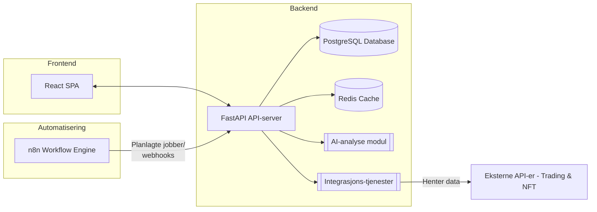

Forbedret og Sammenslått Plan for Investlytics Hub Monorepo

Investlytics Hub – Komplett prosjektplan
========================================

Introduksjon og målsetninger
----------------------------

Investlytics Hub er tenkt som en innovativ plattform som samler data og innsikt om investeringer på ett sted. Prosjektet skal kombinere **trading**\-informasjon (f.eks. aksjer eller kryptovaluta) og **NFT**\-analyse i én integrert løsning. Målet er å tilby brukeren et sentralt "hub" hvor man kan hente inn markedsdata, utføre analyser (inkludert AI-drevne innsikter), visualisere resultater gjennom et brukervennlig grensesnitt, og automatisere arbeidsflyter rundt investeringer.

Denne prosjektplanen er utformet for å demonstrere fullstack-kompetanse ved å benytte moderne teknologier i alle lag av applikasjonen. Løsningen vil bestå av en interaktiv frontend bygget med React, en skalerbar backend bygget med FastAPI, en automatiseringsmotor (n8n) for å håndtere arbeidsflyter, og integrasjoner mot finans- og NFT-tjenester. Planen legger vekt på modulær arkitektur, god kodeorganisering (monorepo), robuste konvensjoner for utvikling og drift, samt en trinnvis roadmap fra **MVP** til et fullt funksjonsrikt system. Dette dokumentet beskriver arkitekturen, teknologivalg, roadmap med faser, og hvordan prosjektet kan fungere som et utstillingsvindu for teknisk dybde og beste praksis.

Arkitektur og teknologier
-------------------------

Arkitekturen til Investlytics Hub er designet som en modulær fullstack-applikasjon. Det betyr at hver del av systemet har tydelig avgrensede ansvarsområder, og ulike komponenter kommuniserer gjennom veldefinerte grensesnitt. Hovedelementene i arkitekturen inkluderer:

*   **Frontend (React)**: En dynamisk enkeltsside-webapplikasjon (SPA) bygget med React (TypeScript) som gir brukeren et interaktivt dashboard. Frontend håndterer presentasjon av grafer, tabeller og brukerinteraksjoner, og kommuniserer med backend via API-kall.
    
*   **Backend API (FastAPI)**: En høyytelses web-API bygget med Python og FastAPI. Backend eksponerer RESTful endepunkter for frontend, håndterer forretningslogikk, innhenting av data fra eksterne kilder, og serverer analyseresultater. Den er modulært oppdelt (se detaljert beskrivelse nedenfor) for å håndtere ulike domenefunksjoner (datahenting, analyse, autentisering m.m.).
    
*   **Database (PostgreSQL)**: Et relasjonsdatabase-system for lagring av vedvarende data. PostgreSQL benyttes til å lagre f.eks. historiske prisdata, brukerpreferanser, resultater av analyser, og andre strukturerte data som behøves. Databaseoppsettet følger gode praksiser med migreringer (f.eks. via Alembic) og indeksoptimalisering for ytelse.
    
*   **Cache (Redis)**: Et in-memory cachelag (Redis) brukes for mellomlagring av hyppig etterspurte data eller tunge beregninger. Dette minsker responstiden og avlaster databasen og eksterne APIer (f.eks. kan nylig innhentede markedspriser eller analyseresultater caches midlertidig). Redis kan også benyttes for køer/streaming dersom det trengs for enkelte arbeidsflyter.
    
*   **Automatisering (n8n)**: n8n er en arbeidsflyt-automatiseringsmotor som integreres for å schedule og automatisere prosesser. Dette kan inkludere planlagte data-innhentinger (f.eks. hente nye priser hver time), utsending av varsler (f.eks. e-post/Slack når visse kriterier oppfylles), eller triggere som reagerer på hendelser. n8n er åpen kildekode og kan kjøre selvhostet; våre n8n-workflows vil samhandle med backend gjennom webhooks eller API-kall.
    
*   **AI-analysemodul**: En egen modul for avansert analyse drevet av kunstig intelligens. Denne komponenten kan benytte maskinlæringsmodeller eller AI-tjenester (f.eks. OpenAI API) for å utføre oppgaver som prediktiv analyse, mønstergjenkjenning i handelsdata, eller generere sammendrag/innsikter. AI-modulen vil typisk kalles fra backend (enten som en integrert del av FastAPI-appen eller som en separat service) når dypere analyse trengs.
    
*   **Integrasjoner mot eksterne API-er**: Systemet vil koble seg mot eksterne datakilder for å hente sanntids- og historiske data. Dette inkluderer API-er for aksje- og kryptopriser (f.eks. Alpha Vantage, Yahoo Finance API) og NFT-markedsdata (f.eks. OpenSea API). Integrasjonene er innkapslet i backend-tjenester eller n8n-noder, med nødvendige sikkerhetsnøkler lagret som konfigurasjon (.env-sekreter).
    

**Arkitekturdiagram:** Under er et diagram (laget med Mermaid) som viser hvordan disse komponentene henger sammen i Investlytics Hub:

_Figur: Oversiktsdiagram over Investlytics Hub sin arkitektur._

Arkitekturen legger til rette for at hver komponent kan utvikles og vedlikeholdes uavhengig, men likevel fungere sømløst sammen. For eksempel kjører frontend og backend som separate prosesser, noe som muliggjør skalering hver for seg ved behov. Backend kan enkelt utvides med nye endepunkter eller tjenester (f.eks. om man legger til en ny datakilde) uten å påvirke andre deler. At koden er modulært organisert bidrar til gjenbruk og enklere testing. Nedenfor følger en mer detaljert beskrivelse av noen sentrale backend-moduler/tjenester.

### Sentrale backend-moduler

For å oppnå en ren arkitektur er backend implementert med flere adskilte moduler/tjenester innad i FastAPI-appen. Hver modul har klart definerte oppgaver og kan testes og utvikles isolert:

*   **API-endepunkter og routing**: Dette laget utgjør FastAPI-applikasjonens grensesnitt. Her defineres REST-endepunktene (f.eks. /api/market-data/, /api/analyze/, /api/user/ osv.). Endepunktene validerer innkommende forespørsler (via Pydantic-skjemaer), kaller underliggende tjenester (som de nedenfor) og returnerer resultater som JSON. Dette laget håndterer også feilhåndtering og returnerer passende HTTP-responser.
    
*   **Autentisering og brukerhåndtering**: En modul som tar seg av innlogging, API-nøkler og tilgangskontroll. For et MVP kan dette være enkelt (f.eks. en API-nøkkel i .env eller OAuth 2.0 for tredjeparts-APIer), men planen er å støtte JWT-basert autentisering for brukerkonti hvis flere brukere skal bruke systemet. Denne tjenesten sørger for at kun autoriserte forespørsler får tilgang til beskyttede endepunkter og at passord og nøkler håndteres sikkert (hashed, ikke i klartekst).
    
*   **Datainnhentingstjeneste (integrasjoner)**: Står for kommunikasjon med eksterne API-er for markedsdata og NFT-data. Denne modulen inneholder logikk for å kalle eksterne tjenester (med riktige parametre og API-keys), transformere responsene til våre interne datamodeller, og lagre resultatene i databasen. Den kan også benytte caching-laget (Redis) for å unngå unødvendige kall. Typisk vil n8n eller planlagte jobber trigge funksjoner her for periodisk oppdatering av data.
    
*   **Analyse- og innsiktstjeneste**: Inneholder domenelogikk for å analysere innsamlet data. Dette inkluderer beregning av nøkkeltall (f.eks. gjennomsnittlig avkastning, volatilitet, trendindikatorer) samt å kalle AI-analysemodulen for mer avanserte innsikter. Resultatene kan lagres i databasen for historikk eller caching for raske svar. Denne modulen kapsler inn både synkrone beregninger (på forespørsel fra en bruker) og asynkrone analyser (som kan kjøres i bakgrunnen via n8n).
    
*   **Varslingstjeneste**: Tar hånd om generering av varsler eller meldinger basert på definerte kriterier. For eksempel, hvis en analysert indikator overstiger en grenseverdi, kan denne modulen initiere et varsel (e-post, Slack, etc.). Selve utsendingen kan skje via n8n-integrasjoner eller tredjeparts SDK-er (f.eks. en e-posttjeneste). Varslingstjenesten kommuniserer med analyse- og datainnhentingstjenesten for å hente relevante triggere.
    
*   **Database- og ORM-lag**: Selv om dette ikke er en "tjeneste" i samme forstand, er databaseintegrasjonen en viktig del av backend. Vi bruker et ORM (f.eks. SQLAlchemy med Pydantic-modeller) for å håndtere databaseoperasjoner trygt. Modellenes skjemaer defineres ett sted og brukes både for validering og lagring, noe som reduserer risiko for inkonsistens. Migreringsverktøy (som Alembic) benyttes for å versjonere databaseskjema ved endringer.
    

Denne inndelingen sørger for at utvidelser i én modul (f.eks. legge til en ny ekstern datakilde) ikke krever store endringer i andre moduler. Det gir også mulighet til å skalere ut enkelte deler separat om nødvendig (for eksempel kunne en svært tung analysemodul vært skilt ut som en egen mikroservice i fremtiden).

Prosjektstruktur og kodeorganisering
------------------------------------

For å håndtere kompleksiteten i et fullstack-prosjekt og legge til rette for ryddig utvikling, benytter Investlytics Hub en **monorepo-struktur**. Det vil si at frontend, backend, arbeidsflyt-skript og dokumentasjon ligger i ett felles Git-repositorium. Dette gjør at versjonshåndtering blir konsistent på tvers av hele prosjektet, og at man kan kjøre alt samlet (f.eks. via Docker Compose).

Hovedmappen inneholder følgende sentrale kataloger og filer:

*   **frontend/** – React-applikasjonen (TypeScript) med kildekode. Her ligger en src/-mappe med komponenter, sider (views), tilstandshåndtering (f.eks. Redux eller React Context), og API-klientkode for å kalle backend. Frontenden har sin egen package.json med avhengigheter og scripts (f.eks. npm start for utvikling).
    
*   **backend/** – FastAPI-backenden (Python). Strukturen her kan følge en konvensjonell oppdeling:
    
    *   app/ – inneholder selve FastAPI-appen, inndelt i undermoduler (f.eks. routers/ for API-routes, services/ for forretningslogikk, models/ for Pydantic-modeller og ORM-modeller, core/ for konfigurasjon og oppstartskode).
        
    *   tests/ – testkode for backend (unit- og integrasjonstester).
        
    *   scripts/ – eventuelle Python-skript for f.eks. initialisering av data eller vedlikeholdsoppgaver.
        
    *   requirements.txt eller pyproject.toml – avhengigheter for backend.
        
*   **workflows/** – Oppsett for n8n-workflows og integrasjoner. Dette kan inkludere JSON-filer eksportert fra n8n som definerer arbeidsflyter, samt dokumentasjon for hvordan de er satt opp. Alternativt kan n8n kjøres separat og ikke inkluderes i repo, men da beskrives oppsettet i dokumentasjon.
    
*   **infrastructure/** – (Valgfritt) Docker Compose-filer, Kubernetes-manifester eller andre devops-relaterte konfigurasjoner. Her kan f.eks. docker-compose.yml ligge for å starte alle tjenester (frontend, backend, database, redis, n8n) lokalt. Også CI/CD-konfigurasjoner (f.eks. GitHub Actions workflow-filer) kan ligge i .github/workflows/.
    
*   **docs/** – Dokumentasjon, inkludert designbeskrivelser, mer detaljerte arkitekturtegninger, og bruker-guider. Kan også inkludere README.md-filer for subprosjektene hvis ønskelig.
    
*   **Konfigurasjonsfiler** – Roten av repoet vil ha viktige filer som .gitignore (for å utelate f.eks. node\_modules/, \_\_pycache\_\_/ og sensitive filer), .env.example (eksempel på miljøvariabler som må settes opp), samt en .vscode/ mappe med innstillinger for Visual Studio Code. Dette kan inkludere en anbefalt liste av utvidelser, spesifikke formateringsregler, og en multi-root workspace-konfigurasjon via en .code-workspace-fil. Slik kan man lett åpne hele prosjektet i VS Code med riktige innstillinger for både frontend og backend.
    

En slik struktur holder koden modulær, men samlet. **Monorepo-tilnærmingen** er spesielt nyttig her fordi frontend og backend utvikles parallelt og har hyppige endringer som må synkroniseres (f.eks. endring av et API-endepunkt i backend og tilsvarende kall i frontend). Med monorepo kan én pull request fange opp begge sider av endringen.

For å sørge for en profesjonell utvikleropplevelse har vi definert klare **konvensjoner**:

*   **Kodeformattering og kvalitet**: Bruk av ESLint/Prettier for JavaScript/TypeScript og Flake8/Black (samt mypy for type-sjekk) for Python. CI-pipelinen vil kjøre disse for å sikre at koden holder en jevn stil og oppdage feil tidlig.
    
*   **Git-konvensjoner**: Fokus på meningsfulle commit-meldinger og bruk av pull requests med code reviews. main-grenen beskyttes slik at alle endringer må gå via PR og bygge grønt på CI før merge.
    
*   **Miljøvariabler**: Alle hemmeligheter og miljøspesifikke konfigurasjoner legges i .env-filer som aldri committes til Git (listet i .gitignore). I repoet inkluderes en .env.example som dokumenterer hvilke variabler som trengs (f.eks. DATABASE\_URL, REDIS\_URL, ALPHAVANTAGE\_API\_KEY, OPENSEA\_API\_KEY osv.). Under utvikling kan man ha en .env.development og for produksjon .env.production som lastes av applikasjonen avhengig av kjøre-miljø.
    
*   **Start/byggeskript**: I rot av prosjektet kan et Makefile eller en samling enkle shell-skript (i scripts/-mappen) hjelpe utviklere å kjøre opp alt. For eksempel:
    
    *   make dev kan starte frontend, backend, database osv. (ved å bruke Docker Compose eller lokale servere).
        
    *   make test kjører alle tester i både frontend og backend.
        
    *   make lint kjører statisk kodeanalyse/formattering i begge deler.Dette sikrer at nye utviklere raskt kan komme i gang og at alle følger samme prosedyre.
        
*   **Dokumentasjon**: Hoved-README i rotmappen gir en oversikt over prosjektet (beskrivelse, teknologier, hvordan komme i gang). I tillegg kan det være separate README-filer i frontend/ og backend/ som går mer i detalj om hver del (f.eks. hvordan UI-komponenter er strukturert, eller API-dokumentasjon). Vi inkluderer også en CONTRIBUTING.md som beskriver hvordan man kan bidra (sette opp miljø, coding guidelines, testing). Roadmap for videre arbeid kan være en egen seksjon i README eller en egen ROADMAP.md som viser planlagte milepæler og features (basert på roadmap under).
    

Roadmap og milepæler
--------------------

Prosjektet deles opp i tydelige faser for å sikre fokus og leveranser i riktig rekkefølge. Under beskrives en foreslått roadmap fra **MVP** til videre utvidelser:

### Fase 1: MVP (Minimum Viable Product)

**Mål:** Levere en fungerende grunnplattform som demonstrerer kjernefunksjonalitetene i Investlytics Hub.

*   **Frontend:** En enkel React-app med et dashboard-grensesnitt. Viser et par statiske sider eller faner, f.eks. "Markedsoversikt" og "NFT-statistikk". Bruker grensesnittkomponenter (diagrammer/tabeller) for å vise data hentet fra backend. UI-et fokuserer på enkelhet (ingen avansert design ennå, men funksjonell visning).
    
*   **Backend:** Oppsett av FastAPI med et par sentrale endepunkter:
    
    *   GET /api/prices/{asset} for å hente gjeldende pris og kanskje siste 24t historikk for et asset (f.eks. en aksje eller kryptovaluta).
        
    *   GET /api/nft/{collection} for å hente noen nøkkeldata om en NFT-kolleksjon (f.eks. gulvpris, volum).
        
    *   Disse endepunktene kan i MVP-en returnere mock-data eller live-data via én integrert datakilde (f.eks. Alpha Vantage for aksjer/krypto og OpenSea for NFT).
        
*   **Datahåndtering:** Integrasjon mot en database (PostgreSQL) settes opp, men i MVP kan man velge å minimalisere bruken av DB (f.eks. bare logge kall eller mellomlagre historikk). Alternativt kan man bruke en enkel SQLite for rask oppstart hvis Postgres er overhead i starten.
    
*   **Caching:** Innføring av Redis for caching av API-svar implementeres for minst ett endepunkt som bevis på konseptet (f.eks. cache prisdata i et par minutter for å redusere hyppige eksternkall).
    
*   **n8n Workflow:** En grunnleggende n8n-instans startes opp med én workflow, for eksempel en tidsplan som henter nye priser hvert 15. minutt og lagrer i databasen via backend-APIet.
    
*   **Dokumentasjon:** Prosjektet har en oppdatert README med instruksjoner for å kjøre opp systemet (lokalt via Docker Compose eller lignende). Beskriver også miljøvariabler som trengs. Ingen omfattende brukerdokumentasjon ennå, men en enkel beskrivelse av MVP-funksjonalitet.
    

Dette MVP-et skal være gjennomførbart i løpet av en kort periode (f.eks. et par uker) og danner grunnlaget for videre arbeid. Det viktigste er at hele end-til-end kjeden fungerer: frontenden kan gjøre et kall og vise data hentet via backenden fra en ekstern kilde.

### Fase 2: Utvidet funksjonalitet

**Mål:** Bygge videre på MVP ved å legge til flere funksjoner, forbedre brukeropplevelse og systemets robusthet.

*   **Flere datakilder:** Legg til støtte for flere aktiva og kilder. For eksempel:
    
    *   Flere API-integrasjoner (kanskje hente kryptodata fra CoinGecko i tillegg, eller NFT-data fra flere markedsplasser).
        
    *   Backend-modulen for datainnhenting blir mer generell og håndterer ulike kilder gjennom et plugin-aktig system.
        
*   **Brukerkontoer og preferanser:** Innføre enkel autentisering (registrering/innlogging). Bruk JWT for session-håndtering på backend og en innloggingsside i frontend. Dette tillater lagring av brukerpreferanser, som hvilke aktiva eller samlinger de vil følge.
    
*   **Analyseforbedringer:** Implementere mer omfattende analyse i backend:
    
    *   Beregn tekniske indikatorer eller trendanalyser over tid for aktiva.
        
    *   Inkludere den dedikerte AI-analysemodulen for f.eks. å generere en kort tekstlig innsikt (“Denne uken har markedet vært volatil, drevet av ...”) basert på data.
        
    *   Tillate brukere å be om analyser on-demand gjennom UI-et (for eksempel "Analyser denne porteføljen").
        
*   **Varslinger og automasjon:** Utnytt n8n bedre ved å konfigurere workflows som:
    
    *   Sjekker betingelser (f.eks. pris over X eller indikator Y under terskel) og sender e-postvarsel.
        
    *   Oppdaterer data mer hyppig eller ved bestemte hendelser (webhooks fra tredjeparts-API inn til vårt system).
        
*   **Forbedret UI/UX:** Gjøre frontend mer interaktiv og polert:
    
    *   Live oppdateringer (f.eks. via websockets fra backend for sanntidskurser).
        
    *   Flere visualiseringer: grafer for pris over tid, topp 5 endringer, etc.
        
    *   Side for “Min portefølje” der innloggede brukere kan legge til aktiva/NFTs de ønsker å spore.
        
*   **Ytelse og skalerbarhet:** Ta i bruk flere av FastAPI’s ytelsesfordeler:
    
    *   Gjøre endepunkter asynkrone der det gir gevinst for bedre gjennomstrømning.
        
    *   Finjustere caching-strategier (bestemme hva som skal caches i Redis og hvordan invalidere cache når data oppdateres).
        
    *   Innføre rate limiting på API-et for å beskytte mot misbruk (mulig gjennom integrasjon med FastAPI-middleware eller tredjepartsbibliotek).
        
*   **Testdekning:** Utvid testing betydelig. Skrive enhetstester for kritiske funksjoner (integrasjonskall, analyselogikk), og ende-til-ende-tester som går gjennom typiske brukerflows (kan bruke f.eks. Cypress for frontend-testing mot et test-API).
    

Etter fase 2 vil systemet ha det meste av kjernefunksjonaliteten på plass, med en del avanserte egenskaper. Man kan vurdere en “beta”-lansering for utvalgte brukere på dette stadiet.

### Fase 3: Modning og skalering

**Mål:** Gjøre Investlytics Hub produksjonsklar, robust og skalerbar, samtidig som flere “nice-to-have” funksjoner legges til.

*   **Sikkerhet og stabilitet:** Gjennomfør sikkerhetsgjennomgang:
    
    *   Sikre alle API-endepunkter med korrekt autentisering/autorisering.
        
    *   Legge inn beskyttelse mot vanlige web-sårbarheter (FastAPI dekker mye by default, men vurder ekstra tiltak).
        
    *   Kontrollere at .env-sekreter håndteres forsvarlig i deploy (f.eks. bruke secrets management i CI/CD i stedet for hardkodede variabler).
        
*   **CI/CD og DevOps:** Sett opp komplett pipeline for bygg og deploy:
    
    *   GitHub Actions (eller tilsvarende) for automatisk kjøring av tester og lint ved pull requests.
        
    *   Bygg Docker-images for frontend og backend ved merges til main.
        
    *   Deploy til en sky eller server (f.eks. AWS, GCP, Azure, Heroku, Fly.io) via automatisert workflow. Vurder Infrastructure-as-Code for konsistent miljø (Terraform, Ansible, eller bare Docker Compose på en VM).
        
*   **Skalering:** Hvis nødvendig, vurder å dele opp eller replikere komponenter:
    
    *   Kjør backend i et cluster (f.eks. via Kubernetes eller Docker Swarm) for å tåle flere brukere og trafikk.
        
    *   Database-tuning (indekser, evt. read-replicas om leselast er høy, caching av hyppige queries).
        
    *   Håndtere større datavolum i NFT-analyser – eventuelt ved å arkivere eldre data eller bruke big data-verktøy for aggregering dersom datasettene blir veldig store.
        
*   **Flere integrasjoner og funksjoner:**
    
    *   Legge til støtte for flere instrumenter (f.eks. integrere markedsdata for råvarer eller makroøkonomiske indikatorer).
        
    *   Implementere en modul for porteføljeforvaltning (brukeren kan legge inn hva de eier, og systemet sporer totalverdi og avkastning over tid).
        
    *   Eventuelt community- eller sosiale funksjoner hvis relevant (f.eks. dele egne analyser med andre brukere), men dette er sekundært.
        
*   **UI/UX Perfeksjonering:** Bruke tilbakemeldinger til å forbedre design og brukerflyt.
    
    *   Responsivt design for mobil og nettbrett.
        
    *   Tema-støtte (mørk/lys modus) for brukerpreferanser.
        
    *   Høy grad av polish på grafer (f.eks. annoteringer, valg av tidsintervaller, eksportmuligheter).
        
*   **Dokumentasjon og demo:** Sikre at all funksjonalitet er dokumentert:
    
    *   Sluttbrukerdokumentasjon (en brukermanual eller hjelpeseksjon som forklarer hvordan man bruker plattformen).
        
    *   Teknisk dokumentasjon oppdatert (arkitekturdiagram, beskrivelser av modulene, hvordan nye utviklere kan sette opp miljøet).
        
    *   Vurdere en offentlig tilgjengelig demo-instans med eksempeldata for å vise frem prosjektet til potensielle arbeidsgivere eller interessenter.
        

Når fase 3 er fullført, vil Investlytics Hub fremstå som et komplett og modent produkt. Videre arbeid utover dette vil typisk være kontinuerlig forbedring basert på brukerfeedback og teknologiske muligheter, men kjernearkitekturen og feature-settet vil være etablert.

### Videre perspektiver (langsiktig)

Selv om hovedmålene er dekket i fase 1–3, kan man på lang sikt utforske:

*   **AI-forbedringer:** Dypere bruk av maskinlæring, f.eks. trening av egne modeller på samlede data for prediksjon av markedsbevegelser eller NFT-verdier.
    
*   **Utvidet økosystem:** Lage et offentlig API for tredjepartsutviklere eller en plugin-arkitektur slik at eksterne kan bygge utvidelser til plattformen.
    
*   **Andre plattformer:** Vurdere en mobilapp (f.eks. React Native) som konsumerer de samme backend-APIene for å nå brukere på smartphone.
    
*   **Open source-community:** Hvis prosjektet open-sources, bygge et miljø der andre kan bidra med nye datakoblinger, analyser eller front-end forbedringer.
    

Disse langsiktige ideene er ikke en del av den konkrete prosjektplanen nå, men viser en visjon for hva Investlytics Hub kan utvikle seg til over tid.

Oppsummering
------------

Investlytics Hub-prosjektet er planlagt som en modulær, fullstack applikasjon som kombinerer flere domenerelevante komponenter – fra datainnsamling og analyse til presentasjon og automasjon. Planen ovenfor har sammenfattet brukerens opprinnelige mål, tidligere forslag fra ChatGPT, og verdifulle innspill fra Google Gemini, til en helhetlig prosjektbeskrivelse.

Gjennom en klar arkitektur, velstrukturert kodebase (monorepo) og en faseinndelt roadmap demonstrerer planen moden teknisk forståelse. Fra MVP-ens avgrensede leveranse til den mer ambisiøse videreutviklingen legges det vekt på beste praksis: sikker håndtering av konfigurasjon (.env), caching for ytelse, CI/CD for kvalitetssikring, og fokus på både frontend- og backend-detaljer.

Målet er at denne planen ikke bare skal resultere i en vellykket implementering av Investlytics Hub, men også fungere som et **utstillingsvindu** for utviklerens fulle bredde av ferdigheter – inkludert moderne webutvikling (React), API-design og databehandling (FastAPI, PostgreSQL, Redis), automasjon (n8n), og integrasjon av AI for smarte analyser. Planen er konkret og gjennomførbar, med et realistisk løp fra konsept til produksjon. Med dette som fundament kan utviklingen starte med trygg forvissning om at prosjektet har en tydelig retning og solid arkitektur.