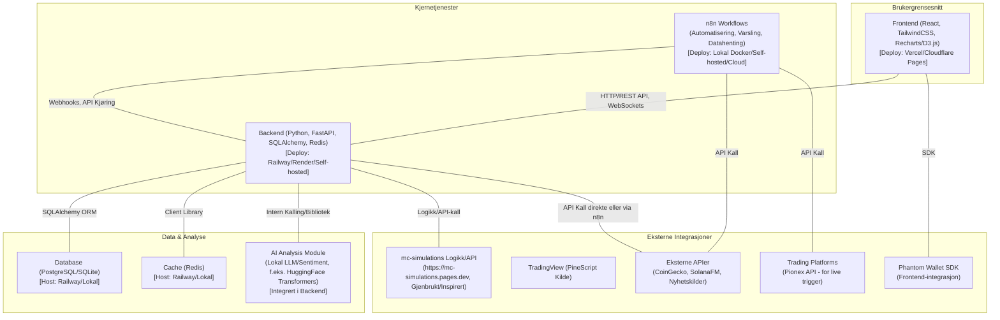

Absolutt! Basert på all teksten du har levert, inkludert dine opprinnelige notater, ChatGPTs utdypinger og Geminis verdifulle innspill, har jeg satt sammen en ny, omfattende og strukturert plan for ditt "Investlytics Hub"-prosjekt. Jeg har forsøkt å integrere det beste fra alle kilder, fylle ut der det trengs, og presentere det på en helhetlig måte.

**Prosjektplan: Investlytics Hub – Fullstack Monorepo Prosjekt**

**Prosjektbeskrivelse:** 
Investlytics Hub er et åpent kildekodeprosjekt (monorepo) designet for å demonstrere avansert fullstack-utvikling og ekspertise innen finansielle systemer. Prosjektet integrerer en React-basert frontend, en Python/FastAPI-backend, og n8n for automatiserte workflows. Det vil inkludere funksjonalitet for Monte Carlo-simuleringer (gjenbruk og utvidelse av mc-simulations), konvertering og backtesting av PineScript tradingstrategier, sanntids NFT-overvåking på Solana, og AI-basert markedsanalyse. Målet er å skape et interaktivt "Smart Investment Dashboard" som gir verdifull innsikt og fungerer som et utstillingsvindu for teknisk dybde og bredde overfor rekrutterere, andre utviklere og potensielle investorer. Prosjektet fokuserer på en MVP (Minimum Viable Product) med tanke på robusthet og fremtidig utvidbarhet.

**1\. Mål med Prosjektet (Oppsummert):**

*   Vise styrke i fullstack-utvikling (React + Python/FastAPI + n8n).
    
*   Demonstrere kompetanse i avansert finansiell modellering (Monte Carlo).
    
*   Integrere og vise automatisert trading-konsepter (fra PineScript til Python).
    
*   Integrere med krypto/NFT-markeder (Solana).
    
*   Skape et visuelt og teknisk imponerende dashboard.
    
*   Bygge et solid åpent kildekodeprosjekt som kan tjene som portefølje.
    

**2\. Arkitektur og Teknologistack**

**2.1. Høynivå Arkitekturdiagram (Mermaid):**


**2.2. Teknologiliste:**

*   **Frontend:** React (med hooks, Context API), TailwindCSS, Recharts/D3.js for visualiseringer.
    
*   **Backend:** Python, FastAPI (med Pydantic for datavalidering), SQLAlchemy (ORM for databaseinteraksjon), Redis (for caching).
    
*   **Database:** PostgreSQL (anbefalt for skyhosting) eller SQLite (for enkel lokal utvikling og MVP).
    
*   **Simulering:** NumPy, Pandas. Logikk og API fra eksisterende mc-simulations ([https://mc-simulations.pages.dev](https://www.google.com/url?sa=E&q=https://mc-simulations.pages.dev)).
    
*   **Trading:** Konseptuell import/mapping av PineScript v6, Backtrader (for backtesting i Python), TA-Lib (for tekniske indikatorer).
    
*   **NFT Monitor:** Solana FM API, Phantom Wallet SDK (for frontend wallet-integrasjon).
    
*   **Automatisering:** n8n (selv-hostet eller skybasert).
    
*   **AI-analyse:** Python-biblioteker for lokale LLMs (f.eks. HuggingFace Transformers med modeller som TinyLlama, Mistral).
    
*   **Hosting:**
    
    *   Kode: GitHub.
        
    *   Frontend: Vercel eller Cloudflare Pages.
        
    *   Backend & Database/Cache: Railway, Render, eller selv-hostet (Docker).
        
    *   n8n: Lokal Docker, selv-hostet server, eller n8n.cloud.
        
*   **Utviklingsmiljø:** VS Code, Docker, Docker Compose.
    

**3\. Monorepo Mappestruktur (VS Code)**

```text
investlytics-hub/
├── .vscode/                    # VS Code workspace-innstillinger (launch.json, settings.json, extensions.json)
├── frontend/                   # React frontend-applikasjon
│   ├── public/                 # Statiske filer (index.html, favicon etc.)
│   ├── src/
│   │   ├── assets/             # Bilder, fonter etc.
│   │   ├── components/         # Gjenbrukbare UI-komponenter
│   │   │   ├── common/         # Knapper, kort, inputfelt etc.
│   │   │   ├── dashboard/      # Spesifikke dashboard-widgets
│   │   │   ├── charts/         # Komponenter for Recharts/D3
│   │   │   └── nft/            # NFT-spesifikke komponenter
│   │   ├── contexts/           # React Context for global state
│   │   ├── hooks/              # Egendefinerte React Hooks
│   │   ├── layouts/            # Hovedlayout-komponenter (f.eks. med sidebar, header)
│   │   ├── pages/              # Sider (Dashboard, Simulation, Trading, NFT etc.)
│   │   ├── services/           # API-kall funksjoner (til backend)
│   │   ├── styles/             # Globale stiler, Tailwind base config
│   │   ├── utils/              # Hjelpefunksjoner
│   │   ├── App.jsx             # Hovedapplikasjonskomponent
│   │   ├── main.jsx            # Inngangspunkt for React-appen
│   │   └── setupTests.js       # Testoppsett
│   ├── .eslintrc.js            # ESLint konfigurasjon
│   ├── .prettierrc.js          # Prettier konfigurasjon
│   ├── package.json
│   ├── tailwind.config.js
│   ├── postcss.config.js
│   └── vite.config.js          # (eller tilsvarende for Create React App)
│
├── backend/                    # Python FastAPI backend-applikasjon
│   ├── app/
│   │   ├── __init__.py
│   │   ├── main.py             # FastAPI app instans, middleware, global config, routermontasje
│   │   ├── api/                # API Endepunkter/Ruter
│   │   │   ├── __init__.py
│   │   │   ├── deps.py         # Avhengigheter (f.eks. get_db, get_current_user)
│   │   │   └── v1/             # API versjon 1
│   │   │       ├── __init__.py
│   │   │       ├── endpoints/  # Faktiske endpoint-filer
│   │   │       │   ├── __init__.py
│   │   │       │   ├── simulation.py
│   │   │       │   ├── trading.py
│   │   │       │   ├── nft.py
│   │   │       │   ├── market_data.py
│   │   │       │   └── ai_sentiment.py
│   │   │       └── schemas.py  # Pydantic-modeller for request/response (kan deles per endpoint)
│   │   ├── core/               # Kjernefunksjonalitet
│   │   │   ├── __init__.py
│   │   │   ├── config.py       # Konfigurasjonsinnstillinger (fra .env)
│   │   │   └── security.py     # (Hvis autentisering legges til senere)
│   │   ├── crud/               # Database Create, Read, Update, Delete operasjoner
│   │   │   ├── __init__.py
│   │   │   ├── base.py         # Base CRUD klasse
│   │   │   └── ...             # Spesifikke CRUD-filer per modell
│   │   ├── db/                 # Databaseoppsett
│   │   │   ├── __init__.py
│   │   │   ├── base_class.py   # SQLAlchemy deklarativ base
│   │   │   ├── database.py     # Engine, SessionLocal
│   │   │   └── models.py       # SQLAlchemy-modeller (kan deles i flere filer)
│   │   ├── services/           # Forretningslogikk og integrasjoner
│   │   │   ├── __init__.py
│   │   │   ├── mc_simulation_service.py
│   │   │   ├── trading_strategy_service.py # Inkl. PineScript "parser/mapper", Backtrader-logikk
│   │   │   ├── nft_monitoring_service.py
│   │   │   ├── sentiment_analysis_service.py
│   │   │   └── external_api_service.py # For CoinGecko etc.
│   │   └── worker/             # (Valgfritt for bakgrunnsjobber med Celery el.l.)
│   ├── tests/                  # Backend-tester (Pytest)
│   │   ├── __init__.py
│   │   ├── conftest.py
│   │   └── api_v1/
│   │       └── test_simulation.py # Eksempel
│   ├── .env.example            # Eksempel på miljøvariabler
│   ├── .gitignore
│   ├── alembic/                # (Hvis du bruker Alembic for DB-migreringer)
│   ├── alembic.ini
│   ├── Dockerfile              # For å bygge backend som en Docker image
│   ├── pyproject.toml          # Anbefalt for avhengigheter med Poetry/PDM
│   └── requirements.txt        # Alternativt, hvis ikke Poetry/PDM
│
├── workflows/                  # n8n workflows og konfigurasjon
│   ├── flows/                  # Eksporterte n8n JSON workflows
│   │   ├── daily_market_update.json
│   │   ├── nft_floor_price_alert.json
│   │   └── trade_execution_signal.json
│   ├── docker-compose.n8n.yml  # For å kjøre n8n lokalt (hvis selv-hostet i Docker)
│   └── README.md               # Instruksjoner for n8n-oppsett og bruk
│
├── simulations/                # Kan inneholde portert Python-kode fra mc-simulations hvis det er enklere for backend
│
├── scripts/                    # Hjelpeskript for utvikling/deployment
│   ├── setup_dev.sh            # Skript for å sette opp utviklingsmiljøet
│   ├── run_dev.sh              # Starter frontend, backend, (evt. n8n, db, cache)
│   └── initial_data.py         # For å populere DB med testdata
│
├── .dockerignore
├── .gitignore                  # Global .gitignore
├── docker-compose.yml          # Docker Compose for hele stakken (dev: backend, db, cache, evt. n8n)
├── README.md                   # Hoved README for prosjektet
├── CONTRIBUTING.md             # Retningslinjer for bidrag
├── ROADMAP.md                  # Prosjektets roadmap
└── LICENSE                     # Prosjektlisens (f.eks. MIT)
```

**4\. Detaljert Modulbeskrivelse og Funksjonalitet (MVP-fokus med utvidelsesmuligheter)**

**4.1. Frontend (React)**

*   **Dashboard med overblikk:**
    
    *   Visning av status og resultater fra Monte Carlo-simuleringer (hentet fra mc-simulations.pages.dev eller via backend).
        
    *   Sanntids (eller hyppig oppdatert) markedsdata for utvalgte aktiva (f.eks. BTC, ETH, SOL, og valgte aksje-tokens).
        
    *   Historiske priser og trendlinjer (Recharts/D3.js).
        
    *   Resultat fra live (papirhandel) og simulerte trades (Backtrader-resultater).
        
    *   Visning av din nåværende NFT-portefølje (Solana).
        
*   **Integrasjon med mc-simulations:**
    
    *   Hente og vise simulerte scenarier direkte fra din online demo: https://mc-simulations.pages.dev.
        
    *   Mulighet for å trigge kjøring av nye simuleringer via backend, med input-parametre. Vise resultater dynamisk.
        
*   **Trading Modul (PineScript-basert):**
    
    *   Input-område for å lime inn/velge en forenklet/forhåndsdefinert PineScript v6-strategi.
        
    *   Backend vil ha _manuelt mappede_ Python-ekvivalenter for 1-2 eksempelstrategier som kan kjøres med Backtrader. (Full automatisk parsing er utenfor MVP-scope).
        
    *   Vise grafisk resultat av backtesting (equity curve, nøkkelstatistikk) fra Backtrader.
        
    *   Knapp for "aktiver live papirhandel" som sender signal til backend, som igjen kan trigge n8n workflow for (f.eks.) Pionex API (for simulert handel).
        
*   **NFT-monitorering (Solana):**
    
    *   Koble til Phantom Wallet (via SDK på frontend) for å hente brukerens wallet-adresse.
        
    *   Vise eide NFTs fra tilkoblet/angitt wallet (data hentet via backend/SolanaFM).
        
    *   Input for å følge floor price på spesifikke Solana NFT-kolleksjoner.
        
    *   Vise varsler mottatt fra backend (via WebSockets) når en ny NFT listes under en definert terskelverdi.
        
*   **AI-basert Analyse Visning (Valgfritt, men stilig for MVP):**
    
    *   Dedikert seksjon/widget for å vise markedssentiment-score eller en kort oppsummering generert av backendens AI-modul.
        

**4.2. Backend (Python/FastAPI)**

*   **API Endepunkter (eksempler, under /api/v1/):**
    
    *   simulation/: Starte nye MC-simuleringer, hente resultater.
        
    *   trading/: Motta strategivalg, starte backtests, returnere resultater, motta signaler for (simulert) live trading.
        
    *   nft/: Hente NFT-data for en wallet, følge floor prices, motta/sende varsel-triggers.
        
    *   market\_data/: Servere markedsdata (hentet fra CoinGecko e.l., cachet i Redis).
        
    *   ai\_sentiment/: Servere sentimentanalyse-resultater.
        
*   **WebSockets:** For sanntidskommunikasjon til frontend (f.eks. simuleringsprogresjon, nye NFT-varsler, live trade-status-oppdateringer).
    
*   **Services (Forretningslogikk):**
    
    *   mc\_simulation\_service.py: Logikk for å kjøre Monte Carlo-simuleringer (gjenbruk/adapter fra ditt mc-simulations prosjekt eller kall til dets API). Bruker NumPy, Pandas.
        
    *   trading\_strategy\_service.py:
        
        *   Logikk for å kjøre pre-definerte strategier (manuelt oversatt fra PineScript-konsepter) med Backtrader.
            
        *   Integrasjon med TA-Lib for tekniske indikatorer.
            
        *   Lagre/returnere backtesting-resultater (ytelsesstatistikk, P/L).
            
        *   Funksjon for å sende signal videre til n8n for (simulert) handelsutførelse.
            
    *   nft\_monitoring\_service.py: Integrasjon med Solana FM API for å hente wallet-info, collection data, floor prices. Logikk for å sjekke mot terskelverdier og initiere varsler.
        
    *   sentiment\_analysis\_service.py: Integrasjon med HuggingFace Transformers for å kjøre lokal LLM/sentimentmodell på nyhetsfeed/tekst. Cache resultater.
        
    *   external\_api\_service.py: Håndterer kall til eksterne APIer (CoinGecko, etc.) med feilhåndtering og caching (Redis).
        
*   **Database (SQLAlchemy & Alembic):**
    
    *   Modeller for å lagre: Brukerinnstillinger (hvis autentisering implementeres), simuleringsresultater, backtesting-resultater, konfigurasjon av overvåkede NFT-kolleksjoner, logg over varsler, cachede markedsdata (evt.).
        
    *   Alembic for databasemigreringer.
        
*   **Caching (Redis):**
    
    *   For markedsdata, sentiment-resultater, API-responser fra eksterne tjenester, evt. andre hyppig brukte, kostbare dataoperasjoner.
        

**4.3. Automatisering (n8n)**

*   **Workflows (eksportert som JSON-filer i workflows/flows/):**
    
    *   daily\_market\_update.json:
        
        *   Trigger: Cron-jobb (f.eks. hver time/dag).
            
        *   Action: Hent ferske markedsdata (CoinGecko) -> Post til backend API for lagring/caching.
            
    *   nft\_floor\_price\_alert.json:
        
        *   Trigger: Periodisk sjekk (via kall til backend API som sjekker SolanaFM).
            
        *   Logikk: Hvis pris < X SOL for en overvåket kolleksjon.
            
        *   Action: Send varsel til Telegram/epost OG/ELLER send melding til backend via WebSocket for frontend-varsel.
            
    *   trade\_execution\_signal.json (for simulert/papirhandel):
        
        *   Trigger: Webhook fra backend når en strategi gir et live signal.
            
        *   Action: Formater og send (simulert) ordre til Pionex API via deres HTTP API.
            
        *   Logging: Logg utfallet av API-kallet (suksess/feil).
            
    *   (Valgfritt) sentiment\_data\_ingestion.json:
        
        *   Trigger: Cron-jobb.
            
        *   Action: Hent nyhetsartikler/tweets (fra definerte kilder) -> Send til backend for AI-analyse -> Lagre/cache sentiment.
            

**5\. Roadmap / Utviklingsplan (Faser for MVP)**

*   **Fase 0: Oppsett og Grunnleggende Struktur (1 uke)**
    
    *   Initialiser monorepo med Git. Opprett GitHub-repo (investlytics-hub).
        
    *   Sett opp VS Code workspace (.vscode/).
        
    *   Grunnleggende mappestruktur for frontend/ (React+Vite/CRA, TailwindCSS) og backend/ (FastAPI, Poetry/PDM).
        
    *   Sett opp Docker for backend, database (PostgreSQL/SQLite), og Redis (lokal utvikling via docker-compose.yml).
        
    *   README.md med prosjektbeskrivelse og foreløpig Mermaid-arkitektur.
        
    *   Enkel "Hello World" kommunikasjon: Frontend henter data fra et /health endepunkt på backend.
        
*   **Fase 1: Monte Carlo Simuleringer Integrasjon (1 uke)**
    
    *   Backend: Lag mc\_simulation\_service.py. Integrer med mc-simulations.pages.dev API eller porter nøkkellogikk.
        
    *   Backend: API-endepunkt for å starte simulering og hente resultater.
        
    *   Frontend: Side/komponent for input-parametre og visning av simuleringsresultater (tabell/graf).
        
    *   Database: (Valgfritt for MVP) Modell for å lagre simuleringsresultater, ellers hentes de live.
        
*   **Fase 2: Trading Modul (Backtesting - 1-2 eksempelstrategier) (2 uker)**
    
    *   Backend: Utvikle trading\_strategy\_service.py. Manuelt oversett 1-2 enkle PineScript-strategier (f.eks. SMA Crossover) til Backtrader-logikk.
        
    *   Backend: Integrer Backtrader og TA-Lib. API-endepunkt for å motta strategivalg (fra pre-definerte), kjøre backtest, returnere resultater (equity curve, nøkkelstats).
        
    *   Frontend: Side/komponent for å velge pre-definert strategi, input-parametre, og vise backtesting-resultater.
        
    *   Database: (Valgfritt for MVP) Modell for å lagre backtesting-resultater.
        
*   **Fase 3: n8n Automatisering (Grunnleggende Dataflyt) & Markedsdata (1 uke)**
    
    *   Sett opp n8n lokalt (Docker) eller bruk n8n.cloud.
        
    *   Backend: API-endepunkt i market\_data.py for å motta og servere markedsdata. Implementer Redis-caching.
        
    *   n8n: Lag daily\_market\_update.json workflow (hent data fra CoinGecko -> Post til backend).
        
    *   Frontend: Widget/seksjon for å vise markedsdata (hentet via backend).
        
*   **Fase 4: NFT Monitorering (Solana) (1-2 uker)**
    
    *   Backend: Utvikle nft\_monitoring\_service.py med SolanaFM API-integrasjon. API-endepunkter for å hente NFT-data for en wallet og følge floor prices.
        
    *   Frontend: Integrer Phantom Wallet SDK for å hente wallet-adresse. Side/komponent for å vise brukerens NFTs og overvåkede kolleksjoner.
        
    *   n8n: Lag nft\_floor\_price\_alert.json workflow. Implementer WebSocket-varsling fra backend til frontend for prisvarsler.
        
*   **Fase 5: AI-basert Analyse (Enkel Sentiment) (1 uke - Valgfritt for strikt MVP)**
    
    *   Backend: Utvikle sentiment\_analysis\_service.py med HuggingFace Transformers (bruk en pre-trent modell for sentiment på eksempeltekst/nyhetsoverskrifter).
        
    *   Backend: API-endepunkt for å hente sentiment-score.
        
    *   Frontend: Widget for å vise sentiment-score/tekst.
        
*   **Fase 6: Trading Modul (Simulert Live Trigger - Konseptuell) (0.5 uke)**
    
    *   Backend: Funksjonalitet i trading\_strategy\_service.py for å sende et "live signal" (payload) til et n8n webhook.
        
    *   n8n: Lag trade\_execution\_signal.json workflow som mottar webhook og gjør et (mock/logget) API-kall til Pionex.
        
    *   Frontend: "Aktiver simulert live" knapp som trigger dette.
        
*   **Fase 7: Testing, Dokumentasjon, Deployment & Polish (1-2 uker)**
    
    *   Skriv grunnleggende enhetstester (Pytest for backend, Jest/RTL for frontend) for kjernefunksjonalitet.
        
    *   Fullfør og poler README.md, CONTRIBUTING.md, ROADMAP.md.
        
    *   Forbered for deployment:
        
        *   Frontend til Vercel/Cloudflare Pages.
            
        *   Backend (med DB/Cache) til Railway/Render.
            
        *   Konfigurer CI/CD med GitHub Actions for automatisk bygg og test (og evt. deploy til staging/prod).
            
    *   Lag en kort demo-video av MVP-funksjonaliteten.
        
    *   UI/UX polish: Sørg for at dashboardet er presentabelt og brukervennlig.
        

**Totalt estimat for MVP: ca. 8-12 uker (avhengig av innsats per uke).**

**6\. GitHub Issues og Milestones**

*   **Labels:**
    
    *   type:feature, type:bug, type:chore, type:docs, type:refactor
        
    *   module:frontend, module:backend, module:n8n, module:ai, module:simulation, module:trading, module:nft
        
    *   priority:high, priority:medium, priority:low
        
    *   status:todo, status:in-progress, status:review, status:done
        
    *   good first issue, help wanted
        
*   **Eksempel på Issue (GitHub format):**
    
    *   **Tittel:** feat(backend): Implementer API endpoint for NFT wallet-data
        
    *   **Beskrivelse:**
        
        *   Skal lage et FastAPI-endepunkt /api/v1/nft/wallet/{wallet\_address}.
            
        *   Endepunktet skal bruke nft\_monitoring\_service.py til å hente NFT-data fra SolanaFM API for den gitte wallet\_address.
            
        *   Returnere en liste av NFT-objekter (navn, bilde-URL, collection).
            
        *   Implementer Pydantic schema for respons.
            
        *   Legg til grunnleggende feilhåndtering for ugyldig adresse eller API-feil.
            
    *   **Akseptansekriterier:**
        
        *   GET /api/v1/nft/wallet/test\_address returnerer 200 OK med forventet data.
            
        *   GET /api/v1/nft/wallet/invalid\_address returnerer 404 eller 400.
            
        *   Grunnleggende enhetstest er skrevet.
            
    *   **Labels:** type:feature, module:backend, module:nft, priority:high
        
*   **Milestones (korresponderer med roadmap-faser):**
    
    *   Milestone 0: Grunnoppsett & Struktur
        
    *   Milestone 1: MC Simuleringer
        
    *   Milestone 2: Trading Backtesting MVP
        
    *   Milestone 3: n8n & Markedsdata
        
    *   Milestone 4: NFT Monitorering MVP
        
    *   Milestone 5: AI Sentiment (Opt)
        
    *   Milestone 6: Simulert Live Trading (Opt)
        
    *   Milestone 7: MVP Lansering (Testing, Docs, Deploy)
        

**7\. Dokumentasjonsstruktur (Norsk)**

*   **README.md (Hovedfil i roten):**
    
    *   **Tittel og Introduksjon:** Kort beskrivelse av Investlytics Hub, prosjektets mål, og hvorfor det er laget (demonstrere kompetanse).
        
    *   **Arkitektur Oversikt:** Inkluder Mermaid-diagrammet og en kort forklaring av hovedkomponentene.
        
    *   **Funksjonalitet (MVP-omfang):** Bullet-liste over hva MVP-versjonen kan gjøre.
        
    *   **Teknologistack:** Oppsummering av brukte teknologier.
        
    *   **Hvordan komme i gang (Installasjon og kjøring lokalt):**
        
        *   Krav (Node.js, Python, Docker, n8n-oppsett etc.).
            
        *   Klone repoet.
            
        *   Oppsett av .env fil(er).
            
        *   Instruksjoner for å starte backend, frontend, database, cache, n8n (f.eks. via docker-compose up eller scripts/run\_dev.sh).
            
        *   Hvordan åpne appen i nettleser.
            
    *   **Bruk av applikasjonen (MVP):** Kort guide til de viktigste funksjonene.
        
    *   **MVP Begrensninger:** Ærlig liste over hva som _ikke_ er med i MVP.
        
    *   **Videre planer:** Pek til ROADMAP.md.
        
    *   **Bidrag:** Pek til CONTRIBUTING.md.
        
    *   **Lisens.**
        
*   **CONTRIBUTING.md:**
    
    *   Hvordan sette opp utviklingsmiljø.
        
    *   Retningslinjer for kode (stil, formattering).
        
    *   Git workflow (branching, PRs).
        
    *   Hvordan rapportere feil eller foreslå forbedringer.
        
*   **ROADMAP.md:**
    
    *   Mer detaljert oversikt over planlagte funksjoner og milepæler (MVP og post-MVP).
        
    *   Fremtidige ideer og visjoner for prosjektet.
        
*   **workflows/README.md:** Spesifikke instruksjoner for oppsett og kjøring av n8n workflows.
    
*   **Kodekommentarer:** Engelsk i koden for bredere forståelse, men hoveddokumentasjon på norsk.
    

**8\. Oppsett og Drift (Utviklingsmiljø)**

*   **.env filer:** Bruk .env.example i backend/ (og evt. rot for globale Docker Compose variabler). Disse kopieres til .env og fylles med faktiske nøkler/URLer (aldri committe .env-filer).
    
*   **Docker Compose (docker-compose.yml i rot):** For å enkelt starte backend, database (Postgres/SQLite), Redis, og evt. n8n for lokal utvikling.
    
*   **VS Code Innstillinger (.vscode/):**
    
    *   launch.json: Konfigurasjoner for debugging av FastAPI og React.
        
    *   settings.json: Anbefalte innstillinger (formattering on save, Python interpreter path, linter-integrasjon).
        
    *   extensions.json: Anbefalte utvidelser (Python, Pylance, Prettier, ESLint, Tailwind CSS IntelliSense, Mermaid Preview, Docker).
        
*   **Scripts (scripts/):**
    
    *   run\_dev.sh: For å starte alle tjenester (eller deler) for utvikling.
        
    *   initial\_data.py: Kan bruke SQLAlchemy for å legge inn litt testdata for enklere demo.
        
    *   setup\_dev.sh: For engangsoppsett (f.eks. opprette .env fra .env.example, installere hooks).
        

**9\. Viktige Hensyn og Videre Utvikling (Post-MVP)**

*   **Feilhåndtering:** Robust feilhåndtering og logging i både frontend og backend.
    
*   **Sikkerhet:** API-nøkler og sensitiv info kun i .env filer. Vurder rate limiting på API-er. Implementer CORS-policy for backend. Forbered for brukerautentisering (OAuth2/JWT).
    
*   **Skalerbarhet:** Tenk på hvordan komponenter kan skaleres (f.eks. asynkrone oppgaver for tunge beregninger i backend, databaseoptimalisering).
    
*   **Brukeropplevelse (UX):** Kontinuerlig fokus på et intuitivt og responsivt grensesnitt.
    
*   **Modularitet:** Fortsett å designe komponenter og tjenester slik at de er så uavhengige som mulig.
    
*   **Utvidelser (Post-MVP):**
    
    *   Full brukerautentisering og brukerprofiler.
        
    *   Flere og mer komplekse trading-strategier, potensielt med GUI for brukerdefinerte regler.
        
    *   Støtte for flere børser/markeder.
        
    *   Mer avansert AI-analyse (prediksjoner, porteføljeoptimalisering).
        
    *   Mobilvennlig grensesnitt/React Native app.
        
    *   Full CI/CD pipeline for produksjonsdeployments.
        
    *   Token-gated dashboards basert på NFT-eierskap.
        

Denne planen bør gi deg et solid og omfattende grunnlag for å starte utviklingen av "Investlytics Hub". Lykke til!