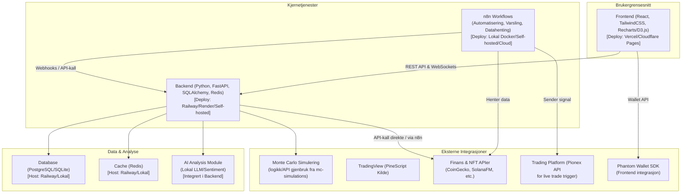
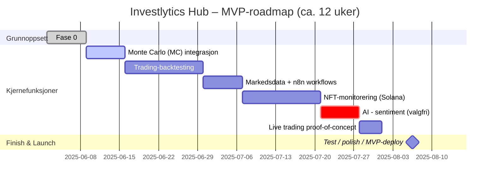
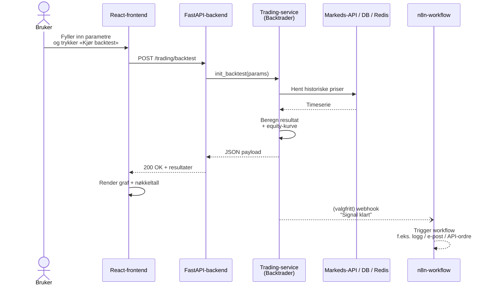

Investlytics Hub – Fullstendig prosjektplan
===========================================

Introduksjon og målsetninger
----------------------------

**Investlytics Hub** er en innovativ, åpen kildekode plattform som samler data og innsikt om investeringer på ett sted. Prosjektet kombinerer **trading-informasjon** (f.eks. aksjer og kryptovaluta) og **NFT-analyse** i én integrert løsning. Brukeren får et sentralt “hub” for å hente inn markedsdata, utføre avanserte analyser (inkludert AI-drevne innsikter), visualisere resultater i et brukervennlig dashboard, og til og med automatisere arbeidsflyter knyttet til investeringer.

Målsetningen er å demonstrere _fullstack_\-kompetanse gjennom bruk av moderne teknologier i alle lag av applikasjonen. Løsningen består av en interaktiv frontend (React), en skalerbar backend (FastAPI), en automatiseringsmotor (n8n) for arbeidsflyt, samt integrasjoner mot finans- og NFT-tjenester. Prosjektet fokuserer først på en **MVP (Minimum Viable Product)** som viser kjernefunksjonalitetene, med et design som er robust og utvidbart for fremtidige forbedringer.

**Hovedmål med prosjektet:**

*   **Fullstack ekspertise:** Demonstrere ferdigheter innen både frontend- og backend-utvikling (React + Python/FastAPI + integrasjoner).
    
*   **Finansiell modellering:** Vise kompetanse i avansert finansiell analyse, f.eks. Monte Carlo-simuleringer for porteføljerisiko.
    
*   **Automatisert trading:** Integrere konsepter fra algoritmisk trading – konvertere/backteste PineScript-strategier i Python og potensielt trigge handler automatisk.
    
*   **Krypto/NFT integrasjon:** Bygge bro mot Web3 ved å hente data fra blokkjeder (Solana NFT-porteføljeovervåkning).
    
*   **Interaktivt dashboard:** Skape et visuelt tiltalende og informativt brukergrensesnitt som presenterer data og analyser intuitivt.
    
*   **Open source portefølje-prosjekt:** Strukturere prosjektet profesjonelt som et åpent kildekode-repositorium for at andre utviklere (og potensielle arbeidsgivere) kan inspisere, kjøre og bidra.
    
Dette prosjektet er kun for demonstrasjons- og utdanningsformål og utgjør ikke finansiell rådgivning

Arkitektur
----------

Arkitekturen til Investlytics Hub er designet som en **modulær fullstack-applikasjon**. Hver del av systemet har tydelig avgrensede ansvarsområder, og komponentene kommuniserer gjennom veldefinerte grensesnitt (typisk HTTP/REST og WebSockets). Nedenfor beskrives hovedelementene i arkitekturen:

*   **Frontend (React):** En dynamisk enkelt-side webapplikasjon (SPA) bygget med React (TypeScript). Frontend står for presentasjon av grafer, tabeller og interaktive dashboard-elementer. UI-et styles med TailwindCSS for et konsistent design uten mye egen CSS. Biblioteker som Recharts (eller D3.js) brukes for finansielle visualiseringer (kurshistorikk, simuleringer, osv.). Frontend kommuniserer med backend via REST API-kall (og WebSockets for sanntid). For MVP vil frontend bestå av et enkelt dashboard med seksjoner for ulike moduler (“Strategi-backtesting”, “Simuleringer”, “NFT-oversikt” m.m.).
    
*   **Backend API (FastAPI):** En høyytelses web-server implementert i Python ved hjelp av FastAPI. Backend eksponerer RESTful API-endepunkter som frontend kaller for data og funksjonalitet. All forretningslogikk og databehandling håndteres her. FastAPI muliggjør også WebSocket-kommunikasjon for sanntidsoppdateringer (f.eks. streaming av simuleringresultater eller markedsdata). Backenden er modulært oppdelt (f.eks. egne _routers_ for ulike funksjonsområder) for å håndtere forskjellige domener: datahenting, analyse, autentisering, osv.
    
*   **Database (PostgreSQL):** Et vedvarende lagringssystem brukes for å lagre strukturerte data. PostgreSQL er valgt som primær database for produksjon, da den er robust og velkjent. Den vil lagre historiske prisdata, resultater av backtesting/simulering, brukerpreferanser, m.m. Under utvikling/MVP kan en enkel SQLite brukes for enkelthet. Vi benytter et ORM (SQLAlchemy) sammen med Pydantic-modeller for å definere og validere data. Databaseoppsettet følger beste praksis med migreringsverktøy (for eksempel Alembic) slik at skjemaendringer kan versjonshåndteres.
    
*   **Cache (Redis):** Et in-memory cache-lag (Redis) benyttes for mellomlagring av hyppig forespurte data eller tunge beregninger, for å redusere responstid og avlaste databasen/eksterne API. For eksempel kan nylig hentede markedspriser eller analyseresultater caches midlertidig. Redis kan også brukes som kø/system for pub-sub hvis vi trenger å implementere hendelsesdrevet logikk (f.eks. melding fra en modul til en annen).
    
*   **Automatisering (n8n):** _n8n_ er en arbeidsflyt-automatiseringsmotor (self-hosted, open source) som integreres for å schedulere og automatisere prosesser på tvers av systemet. n8n kan kjøre periodiske jobber (f.eks. hente nye priser hver time), reagere på eventer (webhooks fra backend) og koble sammen ulike API-er. I vår arkitektur vil n8n-workflows samhandle med backend enten via webhook-kall eller ved å lese/oppdatere databasen. Dette komponentet muliggjør “low-code” automasjon slik at komplekse sekvenser kan bygges visuelt og endres uten å røre backend-koden direkte.
    
*   **AI-analysemodul:** En egen modul for avansert analyse drevet av kunstig intelligens. Denne kan benytte maskinlæringsmodeller eller AI-tjenester (f.eks. OpenAI API eller HuggingFace-transformers) for oppgaver som prediktiv analyse, mønstergjenkjenning i data, eller generering av tekstlige innsikter. AI-modulen vil bli kalt fra backend ved behov for dypere analyse. (I MVP er AI-delen begrenset, men arkitekturen legger til rette for å integrere AI-funksjoner når det er klart.)
    
*   **Eksterne API-integrasjoner:** Investlytics Hub henter data fra en rekke eksterne kilder. Dette inkluderer **finansmarkeds-APIer** (for aksje- og kryptopriser, f.eks. Alpha Vantage, Yahoo Finance eller CoinGecko) og **NFT-tjenester** (f.eks. Solana FM eller OpenSea API for NFT-markedsdata). Integrasjonene kapsles inn i backend-tjenester eller n8n-workflows, og konfigurasjonsnøkler for tilgang holdes i miljøvariabler (.env). Under MVP vil vi bruke et utvalg av slike kilder (for eksempel hente aksjekurser fra Alpha Vantage og NFT-data via solana.fm) for å demonstrere konseptet.
    

Nedenfor er et arkitekturdiagram (skissert i Mermaid) som viser samspillet mellom komponentene i Investlytics Hub:



_Figur: Oversiktsdiagram over Investlytics Hubs arkitektur._

**Arkitekturprinsipper:** Frontend og backend kjører som separate applikasjoner, noe som gjør det mulig å utvikle, teste og skalere dem uavhengig. All kommunikasjon skjer over veldefinerte API-er (HTTP/JSON eller WebSocket), slik at modulene er løst koblet. Endringer i én modul (f.eks. bytte av ekstern data-kilde eller AI-algoritme) påvirker ikke resten av systemet så lenge grensesnittene opprettholdes. Den modulære tilnærmingen gjør koden mer oversiktlig, gjenbrukbar og enklere å utvide med nye funksjoner over tid.

Teknologistack
--------------

Prosjektet benytter en moderne teknologistack, med utvalgte verktøy og språk for hver komponent:

*   **Frontend:** _React_ (funksjonelle komponenter med Hooks og Context API for state). Styling med _TailwindCSS_. Datavisualisering med _Recharts_ (evt. _D3.js_ for mer kontroll). Byggverktøy gjennom _Vite_ (eller Create React App) for rask utvikling. Koden skrives i TypeScript for økt robusthet.
    
*   **Backend:** _Python 3.x_ med _FastAPI_ som web-rammeverk (inkluderer Pydantic for modell-/valideringshjelp). _SQLAlchemy_ ORM for databaseintegrasjon og _Alembic_ for migreringer. _Uvicorn_ ASGI-server for å kjøre FastAPI. Async-støtte i endepunkter der det trengs for I/O-bound tasks.
    
*   **Database:** _PostgreSQL_ i produksjon (på en tjeneste som Railway, Render o.l.), eventuelt _SQLite_ for lokal utvikling/MVP-testing. Databaseoperasjoner håndteres via SQLAlchemy. Viktige data modelleres og lagres her (f.eks. resultat av analyser, innstillinger). Indekser og optimering vurderes for ytelse på store datamengder.
    
*   **Cache:** _Redis_ for caching og rask datatilgang. Brukes via et Python-bibliotek (f.eks. redis-py) fra backend. Kan også brukes for pub/sub-meldinger eller jobbkøer dersom behov.
    
*   **Simuleringer:** Numerisk Python-stack – _NumPy_ og _Pandas_ – for matematiske beregninger. Monte Carlo-logikk hentes fra eller inspireres av det eksisterende prosjektet **mc-simulations** (som kandidaten allerede har laget, hostet på Cloudflare Pages). Dette kan innebære å kalle mc-simulations via API, eller portere deler av logikken til Python kode inne i backend for bedre integrasjon.
    
*   **Trading-analyse:** Utnyttelse av verktøy for algoritmisk trading. _TradingView PineScript v6_ brukes som inspirasjon – utvalgte strategier vil bli manuelt overført/oversatt til Python. For backtesting benyttes biblioteket _Backtrader_ (Python) som håndterer historiske data og strategiutførelse. Teknisk indikator-beregning kan støttes av _TA-Lib_. Dette lar oss simulere strategiers avkastning, som så vises i frontend.
    
*   **NFT-monitorering:** _SolanaFM API_ (eller alternativt offisiell Solana JSON-RPC) for å hente NFT-porteføljedata til en gitt wallet-adresse. I frontenden integreres _Phantom Wallet SDK_ slik at brukeren kan koble sin wallet direkte (for demo formål kan også en adresse tastes inn manuelt). Data om NFTs (navn, bilder, floor price etc.) hentes via backend-kall til Solana API og caches dersom nødvendig.
    
*   **Automatisering:** _n8n_ workflow-automatisering kjøres enten som en Docker-container lokalt eller på en server (evt. n8n.cloud for enkelhet). Workflows vil blant annet hente markedsdata periodisk, sende varsler, og reagere på webhooks. Ingen kode skrives for n8n utover konfigurasjon – men eksporterte workflow-filer (JSON) versjonshåndteres i repoet.
    
*   **AI-analyse:** Python-baserte AI-biblioteker som _HuggingFace Transformers_ kan benyttes for NLP eller små ML-modeller (for eksempel en sentimentanalyse av nyheter/tweets). Tyngre modeller kan kjøres via eksterne APIer (OpenAI GPT-4 for tekstanalyse) hvis det er hensiktsmessig. AI-delen i MVP blir begrenset (f.eks. en enkel sentiment score), men utvides senere.
    
*   **Hosting og drift:** Koden versjonshåndteres på **GitHub**. Frontend kan kontinuerlig deployes til _Vercel_ eller _Cloudflare Pages_ (statisk hosting med CDN). Backend (og tilhørende database/cache) kan kjøre på en skytjeneste som _Railway_ eller _Render_ – eventuelt dockeriseres og kjøre på egen VPS. n8n kan kjøres på en egen node (Docker eller n8n.cloud). Under utvikling benyttes _Docker Compose_ for å starte opp alle tjenester lokalt.
    
*   **Utviklingsmiljø:** Anbefalt IDE er _Visual Studio Code_ med passende utvidelser (for Python, ESLint/Prettier, Tailwind IntelliSense, Mermaid preview, etc.). Prosjektet kan inkludere en .code-workspace som definerer en multi-root workspace (frontend + backend) for å forenkle utvikling. Docker brukes for å sikre konsistente miljøer (f.eks. en container for Postgres og Redis under testing).
    

Mappestruktur
-------------

Prosjektet organiseres som et monorepo, der frontend, backend, workflows m.m. ligger i ett felles Git-repositorium. Under er foreslått mappestruktur for **investlytics-hub**\-repoet:

```text
investlytics-hub/
├── .vscode/                    # VS Code workspace-innstillinger (launch.json, settings.json, extensions.json)
├── frontend/                   # React frontend-applikasjon
│   ├── public/                 # Statiske filer (index.html, favicon, ...)
│   └── src/                    
│       ├── assets/             # Bilder, fonter etc.
│       ├── components/         # Gjenbrukbare UI-komponenter
│       │   ├── common/         # Felles komponenter (knapper, inputfelt, kort, etc.)
│       │   ├── charts/         # Diagramkomponenter (Recharts/D3.js)
│       │   ├── dashboard/      # Dashboard-widgets
│       │   └── nft/            # NFT-spesifikke komponenter
│       ├── contexts/           # React Context for global tilstand
│       ├── hooks/              # Egendefinerte React Hooks
│       ├── layouts/            # Layout-komponenter (f.eks. med navigasjon/meny)
│       ├── pages/              # Sider/visninger (Dashboard, Simulation, Trading, NFT, ...)
│       ├── services/           # Hjelpefunksjoner for API-kall til backend
│       ├── styles/             # Globale stiler, TailwindCSS konfigurasjon
│       ├── utils/              # Diverse hjelpefunksjoner
│       ├── App.jsx             # Hovedapplikasjonskomponent
│       ├── main.jsx            # Inngangspunkt som render App
│       ├── setupTests.js       # Oppsett for Jest/RTL tester (hvis brukt)
│       ├── .eslintrc.js        # ESLint konfigurasjon (JS/TS lint regler)
│       ├── .prettierrc         # Prettier formateringsregler
│       ├── package.json        # NPM scripts og avhengigheter for frontend
│       └── vite.config.js      # Build/verktøy-konfigurasjon (hvis Vite brukes)
│
├── backend/                    # Python FastAPI backend-applikasjon
│   ├── app/
│   │   ├── __init__.py
│   │   ├── main.py             # Oppstart av FastAPI-app, inkludering av routers, middleware
│   │   ├── api/                # API-endepunkter (routers)
│   │   │   ├── __init__.py
│   │   │   ├── deps.py         # Dependencies (f.eks. get_db, auth)
│   │   │   └── v1/             # Versjon 1 av API
│   │   │       ├── __init__.py
│   │   │       ├── endpoints/  # Endepunktsmoduler, inndelt etter domene
│   │   │       │   ├── __init__.py
│   │   │       │   ├── simulation.py
│   │   │       │   ├── trading.py
│   │   │       │   ├── nft.py
│   │   │       │   ├── market_data.py
│   │   │       │   └── ai_sentiment.py
│   │   │       └── schemas.py  # Pydantic-modeller for request/response (kan deles per modul)
│   │   ├── core/               # Kjernefunksjonalitet og konfigurasjon
│   │   │   ├── __init__.py
│   │   │   ├── config.py       # Konfigurasjonsinnstillinger (leser fra .env)
│   │   │   └── security.py     # (Hvis autentisering legges til)
│   │   ├── crud/               # CRUD-operasjoner for DB
│   │   │   ├── __init__.py
│   │   │   ├── base.py         # Baseklasse for CRUD (generisk)
│   │   │   └── ...             # Evt. spesifikke CRUD-moduler per modell
│   │   ├── db/                 # Databaseoppsett
│   │   │   ├── __init__.py
│   │   │   ├── base_class.py   # Deklarativ base for ORM-modeller
│   │   │   ├── database.py     # Opprettelse av DB-engine og Session
│   │   │   └── models.py       # SQLAlchemy-modeller (kan deles i flere filer ved behov)
│   │   ├── services/           # Forretningslogikk og integrasjoner
│   │   │   ├── __init__.py
│   │   │   ├── mc_simulation_service.py       # Håndtering av Monte Carlo-simuleringer
│   │   │   ├── trading_strategy_service.py    # Logikk for tradingstrategier (inkl. PineScript-mapping, Backtrader)
│   │   │   ├── nft_monitoring_service.py      # Håndtering av NFT-data (Solana integrasjon, terskel-sjekker)
│   │   │   ├── sentiment_analysis_service.py  # Kjøre sentimentanalyse (AI-modul integrasjon)
│   │   │   └── external_api_service.py        # Kall mot eksterne API-er (CoinGecko, Alpha Vantage, osv.)
│   │   └── worker/             # (Valgfritt) Bakgrunnsjobber, f.eks. Celery tasks
│   ├── tests/                  # Testkode for backend
│   │   ├── __init__.py
│   │   ├── conftest.py         # Pytest fixtures
│   │   └── api_v1/             # Tester for API (struktur speiler api/v1/)
│   │       └── test_simulation.py
│   ├── .env.example            # Eksempel på miljøvariabler for backend (aldri commite faktiske .env)
│   ├── Dockerfile              # Docker-image bygg for backend
│   ├── pyproject.toml          # Prosjektkonfig hvis Poetry/PDM brukes (alternativ til requirements.txt)
│   ├── requirements.txt        # Python-avhengigheter (hvis man ikke bruker pyproject)
│   └── alembic/                # Database migrasjonsfiler (hvis Alembic tas i bruk)
│       └── ...                 # (alembic.ini konfigurasjon etc.)
│
├── workflows/                  # n8n workflows og integrasjonsfiler
│   ├── flows/                  # Eksporterte n8n workflow-filer (JSON)
│   │   ├── daily_market_update.json
│   │   ├── nft_floor_price_alert.json
│   │   └── trade_execution_signal.json
│   ├── docker-compose.n8n.yml  # (Opsjon) Docker Compose config for å kjøre n8n lokalt
│   └── README.md               # Instruksjoner for oppsett og bruk av workflows
│
├── simulations/                # (Opsjon) Portert kode fra mc-simulations (hvis vi inkluderer dette lokalt)
│   └── ...                     # Evt. skript eller datafiler for simulering
│
├── scripts/                    # Hjelpeskript for utvikling og deployment
│   ├── setup_dev.sh            # Skript for førstegangs oppsett (f.eks. opprette .env fra .env.example)
│   ├── run_dev.sh              # Skript for å starte alle tjenester i dev (frontend, backend, db, cache, n8n)
│   └── initial_data.py         # Skript for å populere databasen med testdata
│
├── docker-compose.yml          # Docker Compose for å kjøre hele stakken lokalt (DB, Redis, Backend, Frontend, ev. n8n)
├── .gitignore                  # Utelukkelse av sensitive/bygde filer (node_modules, __pycache__, .env, etc.)
├── README.md                   # Hoved-dokumentasjon for prosjektet (introduksjon, installasjon, bruk)
├── CONTRIBUTING.md             # Retningslinjer for bidragsytere
├── ROADMAP.md                  # Utdypende roadmap og milepæler
└── LICENSE                     # Valgt lisens for prosjektet (f.eks. MIT)
```

Denne strukturen sørger for en ryddig separasjon mellom frontend- og backend-kode, samtidig som alt ligger samlet for enkelhets skyld. **Monorepo-tilnærmingen** gjør at man kan koordinere endringer på tvers av stacken enklere – f.eks. oppdatering av et API-endepunkt i backend og tilhørende frontend-kall kan skje i én pull request. Mappeinndelingen over er forslag; detaljene kan justeres under implementering, men prinsippet er at hver komponent har sin dedikerte mappe, og at tilleggsressurser (scripts, workflows, docs) er godt organisert.

Utviklingskonvensjoner
----------------------

For å sikre en profesjonell utviklingsprosess og høy kodekvalitet, følges en del konvensjoner og beste praksiser:

*   **Kode og stil:** All kode skrives på engelsk (variabelnavn, funksjoner, kommentarer) for konsistens. Vi følger etablerte stilguider: Python-kode formateres med _Black_ og kontrolleres med _Flake8_ (PEP8-standard), mens JavaScript/TypeScript-kode lintes med _ESLint_ og formateres med _Prettier_. Det settes opp pre-commit hooks eller CI-sjekker som kjører formattering og lint, slik at koden holder en jevn stil. React-komponentfiler bruker PascalCase (f.eks. MyComponent.jsx), mens øvrige filer/mapper bruker kebab-case eller snake\_case etter hva som er idiomatisk i konteksten.
    
*   **Versjonskontroll (Git):** Repoet ligger på GitHub og main-branchen fungerer som produksjonsgren. Alt nytt arbeid skjer i feature branches som navngis beskrivende, f.eks. feature/pinescript-backtesting for nye funksjoner eller fix/socket-connection-bug for feilrettinger. Endringer merges til main via pull requests, som gjerne knyttes mot relevante Issues. Viktige commit-meldinger skrives etter konvensjonell stil (f.eks. prefiks som feat: , fix: , docs: ) og beskriver endringen kort. Hver commit bør være avgrenset og lesbar. **Branch protection** kan brukes på main (kreve godkjenning/CI-passering før merge) for å demonstrere god praksis, selv om man er alene om å utvikle.
    
*   **Testing:** Det legges vekt på å skrive tester for kjernefunksjonalitet. Backend-moduler får enhetstester (Pytest) for viktige funksjoner (f.eks. strategi-logikk, datahenting). API-endepunkter testes med integrasjonstester (f.eks. med FastAPIs testklient). Frontend-komponenter kan testes med Jest/React Testing Library for kritiske interaksjoner. Etter hvert som prosjektet vokser, kan det også settes opp ende-til-ende-tester (f.eks. med Cypress) for å verifisere hele brukerscenarioer. Testene kjører automatisk i CI/CD-pipelinen for å fange opp regressjoner.
    
*   **CI/CD:** Det planlegges en kontinuerlig integrasjon pipeline via **GitHub Actions**. Denne vil kjøre bygg og tester for både backend og frontend ved pull requests eller pushes til main. Linting/formattering kan også valideres her. For deployment settes det opp workflows som ved ny release (tag) eller merge til main, automatisk bygger og deployer frontend (til valgt hosting) og backend (til valgt server/container). CI/CD-rutinene sikrer at prosjektet alltid er i kjørbar stand og forenkler utrulling av oppdateringer.
    
*   **Miljøvariabler:** Alle sensitive nøkler og miljøspesifikke innstillinger holdes utenfor koden i egne **.env-filer**. I repoet inkluderes en backend/.env.example som dokumenterer hvilke variabler som trengs (f.eks. DATABASE\_URL, REDIS\_URL, ALPHAVANTAGE\_API\_KEY, OPENSEA\_API\_KEY etc.). Utviklere kopierer denne til .env og fyller inn verdier lokalt. .gitignore er konfigurert til å utelate faktiske .env-filer for å unngå lekkasje av hemmeligheter. For frontend defineres eventuelle nøkkelkoder i et .env.local (ikke committet) eller via build-verktøyets miljøhåndtering. I produksjonsmiljø benyttes sikre secrets (f.eks. GitHub Secrets eller host-plattformens konfigurasjon) i stedet for flate .env-filer.
    
*   **Utviklingsmiljø og drift:** Docker brukes for å speile produksjonsstacken lokalt. En docker-compose.yml i roten gjør det enkelt å starte opp database, cache, backend og eventuelt n8n i en kommando. Dette sikrer at onboarding av nye bidragsytere går raskt: kjør docker-compose up og man har en lokal instans kjørende. For frontend kan man kjøre npm start lokalt (kobler mot backend-containeren), eller legge frontend inn i compose hvis ønskelig. I .vscode/ mappen ligger det anbefalte innstillinger og debug-konfigurasjoner (slik at man kan sette breakpoints i Python via VSCode, kjøre frontend-devserver med hot-reload, osv.).
    
*   **Dokumentasjon i kode:** Koden skal inneholde meningsfulle docstrings og kommentarer der det trengs (spesielt for komplisert logikk). Dette hjelper andre utviklere (og fremtidig oss selv) å forstå hensikten med kodestykker. I tillegg oppdateres markdown-dokumentasjonen jevnlig for å reflektere endringer i arkitektur eller bruk.
    

Gjennom å følge disse konvensjonene vil prosjektet fremstå profesjonelt og vedlikeholdbart. Andre utviklere kan enklere bidra, og man unngår mange vanlige fallgruver rundt kodekvalitet og drift.

Roadmap og milepæler
--------------------

Utviklingen deles inn i faser med tydelige delmål, slik at vi til enhver tid kan ha en fungerende versjon og kontinuerlig bygge videre. Hver fase avsluttes med en definert **milepæl** i GitHub (se egen seksjon om GitHub-organisering). Nedenfor er en foreslått roadmap fra MVP til videre utvidelser:

*   **Fase 0: Oppsett av grunnstruktur (ca. 1 uke)**
    
    *   Opprett GitHub-repo (_investlytics-hub_) og sett opp initial prosjektstruktur for frontend og backend (tom React-app og FastAPI-app).
        
    *   Konfigurer utviklingsverktøy: integrer TailwindCSS i React, opprett requirements.txt/pyproject.toml for backend, og legg til linter/formatter konfigurasjoner.
        
    *   Sett opp Docker Compose med PostgreSQL og Redis for lokal kjøring. Verifiser at databasen kan kontaktes fra backend.
        
    *   Lag et enkelt _Hello World_\-scenario: f.eks. et /api/health endpoint i backend som frontend kaller og viser status fra. Dette bekrefter at grunnleggende frontend-backend kommunikasjon fungerer.
        
    *   Skriv en første versjon av README.md som beskriver prosjektet og arkitekturen (inkluder arkitekturdiagrammet).
        
*   **Fase 1: Monte Carlo-simulering (MC) integrasjon (ca. 1 uke)**
    
    *   **Backend:** Implementer mc\_simulation\_service.py som enten kaller det eksterne **mc-simulations** API-et eller kjører en lokal port av logikken. Lag et API-endepunkt /api/v1/simulation som tar inn parametre (f.eks. startkapital, antall simuleringer) og returnerer simuleringsresultater (f.eks. en distribusjon av sluttverdier eller forventet avkastning).
        
    *   **Frontend:** Lag en side eller komponent for _Simulering_. Brukeren kan angi noen parametre og trigge simulering via backend-API. Vis resultatene grafisk, f.eks. i en graf eller tabell (bruk Recharts for å vise fordeling, percentiler, etc.).
        
    *   **Database:** (Hvis ønskelig) Definer en enkel modell for å loggføre simuleringer som kjøres, slik at man kan hente opp tidligere resultater. Alternativt caches bare siste resultat i minnet.
        
    *   Verifiser at brukeren kan gjennomføre en simulering ende-til-ende: input i frontend -> API-kall -> backend beregner -> resultat vises i UI.
        
*   **Fase 2: Trading-modul – backtesting av strategier (ca. 2 uker)**
    
    *   **Backend:** Implementer trading\_strategy\_service.py. Start med å definere 1-2 enkle tradingstrategier (f.eks. et glidende snitt kryss, som du har i PineScript fra før). Bruk _Backtrader_\-biblioteket til å kjøre en backtest av strategien mot historiske data. Inkluder bruk av _TA-Lib_ om nødvendig for indikatorer. Lag API-endepunkt /api/v1/trading/backtest som tar inn valg av strategi (navn eller ID) og returnerer resultater (f.eks. avkastning, Sharpe ratio, en tidsserie for porteføljeverdi).
        
    *   **Datahenting:** Sikre at vi har historiske prisdata for backtest. Dette kan enten komme fra database (hvis vi har lastet ned via n8n), eller ved et direkte API-kall i øyeblikket. For MVP kan man hardkode/bruke et begrenset datasett (f.eks. CSV-fil eller hente siste 30 dager via en ekstern API).
        
    *   **Frontend:** Lag en seksjon for _Strategi Backtesting_. Brukeren skal kunne velge en forhåndsdefinert strategi og f.eks. en ticker/tidsperiode. Ved “Kjør backtest” kalles API-et, og resultatene vises: gjerne både som graf (porteføljeverdi over tid) og nøkkeltall (f.eks. total avkastning prosent).
        
    *   Test at ulike strategivalg gir plausibelt forskjellige resultater, og at feil håndteres (f.eks. gi melding hvis data ikke finnes).
        
*   **Fase 3: Markedsdata & n8n arbeidsflyt (ca. 1 uke)**
    
    *   **n8n:** Sett opp en enkel n8n workflow _daily\_market\_update_. Denne skal med jevne mellomrom hente markedspriser fra en API (f.eks. bruke CoinGecko for priser på BTC, ETH, SOL, eller Alpha Vantage for en aksje). Workflowen kan så enten lagre data direkte til databasen (via en HTTP request til backend) eller skrive til en delt fil som backend leser.
        
    *   **Backend:** Lag et endepunkt /api/v1/market\_data/{asset} som returnerer prisdata (f.eks. siste pris og evt. historikk) for en gitt ticker/krypto. I første omgang kan dette returnere dummy-data eller lese fra en statisk JSON som n8n har oppdatert. Implementer også caching: hvis data er nylig oppdatert av n8n, lever fra Redis-cache i stedet for å treffe database/API hver gang.
        
    *   **Frontend:** Legg til en _Markedsoversikt_ widget som viser noen utvalgte markedsdata (for eksempel “BTC: $XYZ” og “ETH: $ABC”). Denne henter data fra /api/v1/market\_data endepunktene.
        
    *   **Varsling (opsjon):** Om tid, konfigurer n8n til å sende et varsel dersom en pris beveger seg over/under et visst nivå, bare for å demonstrere integrasjonen (f.eks. en Telegram eller e-post node).
        
    *   Sikre at dataflyten fungerer: n8n oppdaterer data, backend serverer det, frontend viser det.
        
*   **Fase 4: NFT-portefølje monitorering (ca. 1–2 uker)**
    
    *   **Backend:** Implementer nft\_monitoring\_service.py som integrerer mot Solana. Lag API-endepunkt /api/v1/nft/wallet/{address} som henter alle NFT-er tilhørende en Solana wallet-adresse (via SolanaFM API eller lignende). Returner relevante data som navn på NFT, symbol, eventuelt en URL til metadata/bilde. I tillegg lag et endepunkt for NFT-kolleksjonsovervåkning (f.eks. POST /api/v1/nft/watch med en kolleksjonsidentifikator og pristerskel), som backend kan bruke til å registrere en interessert kolleksjon.
        
    *   **Frontend:** Lag en _NFT_ seksjon. Inkluder et inputfelt hvor brukeren kan skrive inn eller koble til sin Solana wallet (Phantom Wallet integrasjon for enkelhets skyld). Ved innsending vises en liste over NFT-ene i wallet med navn og evt. bilde. Lag også UI for å overvåke en NFT-kolleksjon: f.eks. skriv inn “DeGods – floor price < 50 SOL” som en regel.
        
    *   **n8n:** Lag workflow nft\_floor\_price\_alert.json som kanskje hver time sjekker floor price (via et API) for overvåkede kolleksjoner. Om prisen faller under terskel, trigge en handling – f.eks. sende en melding til backend (som via WebSocket pusher varsel til frontend) eller sende en e-post.
        
    *   **WebSocket:** Implementer en enkel WebSocket-kanal i backend for varsler, slik at frontend som er tilkoblet kan motta push-meldinger om f.eks. “NFT X floor price below threshold!”.
        
    *   Test ved å bruke en faktisk wallet-adresse (eller en test-wallet) for å se at NFT-ene vises. Test også at overvåkning kan registreres (selv om man kanskje simulerer varselet manuelt).
        
*   **Fase 5: AI-basert sentimentanalyse (Valgfri for MVP, ca. 1 uke)**_Denne fasen prioriteres kun hvis tid; den er ikke kritisk for MVP men gir “wow”-faktor._
    
    *   **Backend:** Implementer sentiment\_analysis\_service.py som bruker en enkel forhåndstrent modell (f.eks. en liten sentiment-analysis model via HuggingFace) for å analysere tekst. Teksten kan være en nyhetsoverskrift eller tweet om markedet. Lag et API-endepunkt /api/v1/ai/sentiment som returnerer en sentiment score eller kort oppsummering.
        
    *   **Frontend:** Legg til en komponent i dashboardet som viser “Markedssentiment”. Dette kan være så enkelt som en grønn/rød indikator med tekst som hentes fra /api/v1/ai/sentiment. Evt. la brukeren trykke “Analyser nyheter” for å trigge et kall.
        
    *   **Integrasjon:** (Valgfri) Koble n8n workflow sentiment\_data\_ingestion.json for periodisk å hente f.eks. siste nyhetsoverskrifter, sende dem til backend for analyse, og lagre resultatet i cache. Frontend kan da bare hente siste beregnede sentiment.
        
    *   Dette demonstrerer bruk av en AI-komponent i arkitekturen, om enn i begrenset omfang.
        
*   **Fase 6: Simulert “live” trading (Konseptbevis, ca. 0.5 uke)**
    
    *   **Backend/n8n:** Bygg videre på trading-modulen ved å simulere et live trading-scenario. Når en backtest-strategi gir et nytt signal (f.eks. gyldig kjøpssignal ved slutten av datasettet), la trading\_strategy\_service.py utløse et webhook-kall til n8n (f.eks. ved å bruke Python requests). Sett opp en n8n-workflow trade\_execution\_signal.json som lytter på dette webhooket. Workflowen kan i sin enkleste form logge signalet, eller kalle et tredjeparts API som _Pionex_ (en trading-bot plattform) for å plassere en dummy order.
        
    *   **Frontend:** Legg til en knapp “Aktiver live trading” i strategi-seksjonen. Hvis aktivert, og når brukeren kjører en backtest som genererer signal, behandler backend det som en “live” situasjon og sender til n8n. Frontend kan vise en melding som “Live-signal sendt for utførelse” for demoformål.
        
    *   **Resultat:** Selv om dette ikke utfører ekte handler, viser det arkitekturens evne til å koble seg mot trading-plattformer og automatisere handlinger.
        
*   **Fase 7: Testing, dokumentasjon og lansering av MVP (ca. 1–2 uker)**
    
    *   **Testing:** Gå gjennom alle tidligere faser og skriv ekstra tester der det mangler. Sørg for at kritiske deler (strategilogikk, simulering, API-kall) har enhetstester. Kjør integrasjonstester for hele flyten (for eksempel: kall backtest-endepunktet med en kjent dataset og verifiser respons). Test også frontend manuelt i ulike scenarioer for å fange opp bugs.
        
    *   **Polering:** Rydd opp i UI og UX for demo. Det kan inkludere bedre fargevalg, layout-justeringer for responsiv visning, og generelt sørge for at appen ser presentabel ut. Legg til feilhåndtering og brukermeldinger der det er nødvendig (f.eks. “Ingen data funnet” meldinger).
        
    *   **Dokumentasjon:** Oppdater README.md med klare instruksjoner for oppsett og bruk. Sørg for at arkitekturdiagram og forklaringer stemmer med implementasjonen. Fyll ut CONTRIBUTING.md (hvordan bidra) og ROADMAP.md (oppdatert status på hva som er gjort og hva som kan komme).
        
    *   **Deployment:** Gjør klar for lansering av MVP:
        
        *   Bygg frontend for produksjon og deploy til valgt host (f.eks. push til Vercel eller Cloudflare Pages).
            
        *   Deploy backend til en live URL (for eksempel på Railway eller en annen host).
            
        *   Kjør et siste integrasjonstestscenario mot den prod-lignende oppsetningen.
            
    *   **Presentasjon:** Lag eventuelt en kort video eller demo-beskrivelse som kan brukes for å vise prosjektet til interessenter. Tag en release i GitHub (f.eks. v0.1.0) når alt er klart.
        

Totalt anslås det omkring **8–12 uker** å komme i mål med MVP (avhengig av hvor mye tid som investeres per uke). Hver fase beskrevet over er tenkt som en **milepæl** i prosjektet. Underveis kan noen faser overlappe noe eller justeres etter behov, men rekkefølgen prioriterer først en fungerende basis (fase 0–1), deretter de mest unike funksjonene (fase 2–4), og til slutt finpuss og ekstra forbedringer (fase 5–7).

## Gantt-diagram — visuell roadmap


## Dataflyt – eksempel «Kjør backtest»


GitHub-organisering
-------------------

Prosjektet bruker GitHub som samarbeidsplattform, med Issues for oppgavehåndtering, Labels for kategorisering, og Milestones for å gruppere leveranser. Under er forslag til oppsett:

*   Etikettene kan kombineres (f.eks. en issue kan merkes type:feature + module:backend + priority:high for en kritisk backend-ny funksjon). Dette gir mulighet til å filtrere på f.eks. alle frontend-oppgaver, eller alle høy-pri saker uavhengig av modul.
    
    *   Type/kategori: type:feature, type:bug, type:docs, type:chore (annet vedlikehold), type:refactor
        
    *   Modul/område: module:frontend, module:backend, module:n8n, module:simulation, module:trading, module:nft, module:ai
        
    *   Prioritet: priority:high, priority:medium, priority:low
        
    *   Status (valgfritt, kan alternativt håndteres via prosjektboard): status:todo, status:in-progress, status:review, status:done
        
    *   Andre: good first issue (enkle oppgaver for nye bidragsytere), help wanted (her trengs det innspill/bidrag)
        
*   **Eksempel Issue:**_Tittel:_ **feat(backend): Implementer API-endepunkt for NFT-wallet**_Beskrivelse:_
    
    *   **Hva:** Utvikle et nytt FastAPI-endepunkt /api/v1/nft/wallet/{wallet\_address} som returnerer NFT-porteføljen for en gitt Solana wallet.
        
    *   **Hvordan:** Bruke nft\_monitoring\_service.py til å hente data fra SolanaFM (eller tilsvarende) API. Implementere Pydantic-skjema for responsen (liste av NFT-objekter med felt som navn, bildeURL, koleksjonsnavn). Håndtere feil som ugyldig adresse eller API-feil med passende feilkoder.
        
    *   **Hvorfor:** Dette muliggjør at frontend kan vise en brukers NFT-portefølje ved å oppgi wallet-adressen. Viktig del av NFT-dashboard funksjonaliteten._Akseptansekriterier:_
        
    *   Kall til /api/v1/nft/wallet/{wallet\_address} med en gyldig adresse returnerer 200 OK og en JSON-liste over NFT-er (minst navn og evt. bilde-link per NFT).
        
    *   Kall med ugyldig eller tom wallet-adresse håndteres med 400/404-feil og feilmelding.
        
    *   Enhetstest skrevet som simulerer respons fra Solana API (mock) og verifiserer at endepunktet formaterer data korrekt._Labels:_ type:feature, module:backend, module:nft, priority:high
        
*   **Milestones:** Vi oppretter milepæler som korresponderer med roadmap-fasene beskrevet over. Forslag:
    
    *   **Milestone 0: Grunnoppsett & Struktur** – Initielt oppsett (fase 0).
        
    *   **Milestone 1: MC Simuleringer** – Monte Carlo-delen fungerer (fase 1).
        
    *   **Milestone 2: Trading Backtesting MVP** – Strategi-backtesting implementert (fase 2).
        
    *   **Milestone 3: Dataflyt & Markedsdata** – n8n og markedsdata integrert (fase 3).
        
    *   **Milestone 4: NFT Monitorering** – NFT-delen ferdig (fase 4).
        
    *   **Milestone 5: AI Sentiment (opsjon)** – Sentiment-funksjon (fase 5, hvis gjennomført).
        
    *   **Milestone 6: Live Trading (opsjon)** – Simulert live trading-opplegg (fase 6).
        
    *   **Milestone 7: MVP Lansering** – Testing, dokumentasjon og deploy gjennomført (fase 7).
        

Hver Issue som opprettes knyttes til en milepæl dersom det er relevant for en av leveransene over. Progresjon kan da enkelt følges ved å se hvor mange Issues som er lukket i hver milepæl (GitHub viser prosent fullført). Vi kan også benytte GitHub Projects (et Kanban-board) for å få en visuell oversikt: typisk kolonner “To do / In progress / Done”, integrert med Issues via status-labels eller automatisering. Dette er spesielt nyttig hvis flere skal bidra parallelt.

Dokumentasjon i repoet
----------------------

God dokumentasjon er kritisk for et prosjekt som dette, både for at nye utviklere skal kunne bidra og for at utenforstående (rekrutterere, interessenter) skal forstå løsningen. All hoveddokumentasjon skrives på norsk (for å demonstrere kommunikasjonsevner, mens kodekommentarer holdes på engelsk for internasjonal forståelse). Repositoriet vil inneholde følgende sentrale dokumentasjonsfiler:

*   **README.md (hoveddokumentasjon):** Introduksjon av Investlytics Hub med mål og motivasjon. Inneholder en oversikt over arkitekturen (inkl. mermaid-diagrammet), liste over kjernefunksjonalitet i MVP, og en oppsummering av teknologistacken. Viktigst: README gir trinnvise instruksjoner for hvordan man kjører prosjektet lokalt – fra kloning av repo, oppsett av miljøvariabler, installasjon av avhengigheter i både backend og frontend, til å starte serverne (f.eks. via Docker Compose eller manuelt med npm start / uvicorn). Videre forklares kort hvordan man bruker applikasjonen (f.eks. navigere til riktig URL, hvor man finner de ulike modulene i UI). README nevner også eventuelle **begrensninger i MVP** (f.eks. at autentisering ikke er implementert, kun én strategi tilgjengelig, data er mocket her og der) for å sette forventninger riktig. Til slutt listes planer fremover og hvordan man kan bidra (ref. CONTRIBUTING.md), samt lisensinformasjon.
    
*   **CONTRIBUTING.md:** Retningslinjer for hvordan eksterne kan bidra. Forklarer hvordan man setter opp utviklingsmiljø (vise til README for kjøring, samt evt. ekstra steg for testdatabase etc.), kodestil og konvensjoner (som beskrevet over), og prosedyre for å foreslå endringer (forke repo, lage feature branch, commit meldinger, pull request som refererer til en issue). Den oppfordrer til å opprette Issues for bugs/ønsker og beskriver forventninger om oppførsel (Code of Conduct). Dette dokumentet skal gjøre det lett for en ny utvikler å komme i gang med prosjektet og vite hvordan de skal samarbeide gjennom git/GitHub.
    
*   **ROADMAP.md:** En mer detaljert tidslinje over planlagte funksjoner og versjoner fremover. Bygger på roadmap-seksjonen i denne planen, men kan oppdateres etter hvert som MVP leveres og nye ideer kommer til. ROADMAP.md kan strukturere planene i et lengre tidsperspektiv: f.eks. MVP v0.1, Planlagte forbedringer v0.2, v0.3 osv., samt _langsiktige visjoner_. Dette gir alle interessenter innsikt i prosjektets retning og prioriteringer, uten å måtte grave i alle enkelt-issues.
    
*   **workflows/README.md:** (Hvis nødvendig) Instrukser spesifikt for n8n-workflows – f.eks. hvordan man importerer dem, hva som trengs av nøkler for å kjøre dem, og eksempler på hvordan workflowene virker. Alternativt kan dette inkluderes i hoved-README hvis det er kort.
    
*   **LICENSE:** Prosjektet vil ha en åpen kildekode-lisens, sannsynligvis MIT License (som er vanlig for slike prosjekter med få restriksjoner). Lisensfilen legges ved slik at det er klart for alle brukere og bidragsytere at de kan bruke koden fritt innenfor lisensbetingelsene.
    

I tillegg til disse filene vil vi benytte GitHubs muligheter for Wiki dersom det trengs å publisere lengre guider, men mest sannsynlig er markdown-filene i repo tilstrekkelige. All dokumentasjon holdes oppdatert i takt med koden (f.eks. hvis et API-endepunkt endres, endres også eventuell dokumentasjon av det). Målet er at hvem som helst skal kunne klone prosjektet og få det til å kjøre ved å følge README, og at de skal få en full forståelse av hva prosjektet innebærer ved å lese dokumentasjonen.

## Viktige hensyn og videre utvikling

Avslutningsvis er det verdt å nevne noen **ikke-funksjonelle hensyn** og mulige **videre utvidelser** utover MVP, for å sikre at prosjektet er robust og fremtidsrettet:

### 1. Ikke-funksjonelle hensyn (må ivaretas allerede i MVP)

| Tema | Detaljer / anbefalte tiltak |
|------|-----------------------------|
| **Feilhåndtering** | • Detaljert, strukturert logging i backend (INFO / WARN / ERROR)<br>• Håndter tap av eksterne API elegant (time-outs, retries, circuit-breaker)<br>• Frontend viser brukervennlig feilmelding (f.eks. «Tjenesten er utilgjengelig, prøv igjen senere») i stedet for å krasje |
| **Sikkerhet** | • Input-validering via Pydantic<br>• Stram CORS-policy i produksjon (kun godkjente domener)<br>• Hemmelige nøkler kun på server (.env / secret-store), aldri til klienten<br>• Klar for JWT / OAuth2 når brukerprofiler innføres<br>• Rate-limiting på utsatte endepunkter |
| **Skalerbarhet** | • Horisontal skalering av backend bak load-balancer<br>• DB-indekser + replikering når lesevolum øker<br>• Aggressiv Redis-cache for tunge eller hyppige kall<br>• n8n på egen node ved mange workflows<br>• Asynkrone jobber (Celery / RQ) for CPU-tunge prosesser |
| **Brukeropplevelse (UX)** | • Responsivt design (desktop + mobil)<br>• Lys/mørk temavelger<br>• Interaktive grafer (zoom, hover-tooltip)<br>• Drag-and-drop-oppsett av dashboard-widgets (post-MVP)<br>• Løpende innsanking av brukerfeedback |
| **Modularitet / kodehygiene** | • Nye features = egne moduler / tjenester<br>• Unngå duplisering – felles util-pakker<br>• Strenge PR-regler og code-review for isolerte endringer |

### 2. Mulige utvidelser **etter** MVP

| Område | Hva kan legges til - eksempel på verdiøkning |
|--------|----------------------------------------------|
| **Brukerprofiler** | Full registrering / OAuth 2.0 (Google, GitHub). Lagre foretrukne aktiva, egne simuleringer, tilpasset dashboard-layout. |
| **Flere trading-strategier** | Større strategibibliotek, GUI-bygger for regler, på sikt PineScript-parser som genererer Python-kode automatisk. |
| **Sanntidsdata & live / paper-trading** | WebSocket-feed fra børs ⇒ sanntids­grafer; «paper trading»; valgfri integrasjon mot Pionex API m.m. for ekte handler. |
| **Porteføljeforvaltning** | Samlet oversikt over aksjer, krypto og NFT; spore P/L og risiko; daglige/ukentlige rapporter. |
| **Utvidet aktivastøtte** | Flere markeder (fond, råvarer …) og blokkjeder (Ethereum NFT, DeFi-posisjoner). |
| **AI-forbedringer** | Pris-prediksjon, anomaly-deteksjon, AI-chat-assistent som svarer på portefølje-spørsmål basert på egne data. |
| **Mobilopplevelse** | Fullt responsiv webapp *eller* egen React-Native-app som bruker samme REST / WebSocket-API. |
| **Produksjons-DevOps** | Kubernetes, blue-green deploy, observabilitet (Prometheus + Grafana, ELK-stack). |
| **Community / plugin-økosystem** | Offentlig API + plugin-arkitektur; GitHub Pages-side + blogg for å bygge et åpent utviklermiljø. |

----
<details>
<summary><strong>Tillegg - meta-notat fra Gemini 2.5 Pro</strong></summary>

Dette er en utrolig grundig og velstrukturert prosjektplan! Du har dekket de aller fleste aspekter som kreves for et komplekst fullstack-prosjekt, fra arkitektur og teknologi til roadmap og utviklingskonvensjoner. Det er tydelig at det ligger mye tankearbeid bak.

Når det er sagt, siden du spør, her er noen få punkter du kanskje kan reflektere over eller vurdere å tilføye for å berike planen ytterligere. Dette er ikke kritikk, men snarere forslag til "prikken over i-en" eller ting som kan være nyttige å ha i bakhodet:

1.  **MVP – Vær Brutalt Ærlig med Scope:**
    
    *   Planen din definerer en MVP, men selv innenfor MVP-fasene er det mange ambisiøse delmål. For et porteføljeprosjekt (spesielt hvis du utvikler alene) er det _ekstremt_ lett for scope creep.
        
    *   **Tilføyelse/Refleksjon:** Vurder å definere en "MVP av MVP-en" eller en "Fase 0.5" som KUN inneholder det _absolutt minimale_ for å vise _én_ kjernefunksjonalitet ende-til-ende på en imponerende måte. For eksempel:
        
        *   Backend + Frontend + Én enkel Backtrader-strategi (kanskje med hardkodet data i starten) + Visualisering av resultat.
            
    *   Å få _noe_ komplett og polert tidlig gir motivasjon og et konkret utgangspunkt for resten. Alt annet kan bygges på derfra. Tidsestimatene dine (f.eks. 1 uke for MC-integrasjon) er optimistiske hvis du støter på uforutsette problemer.
        
2.  **Konkretisering av "PineScript-oversettelse":**
    
    *   Planen nevner at "utvalgte strategier vil bli manuelt overført/oversatt til Python". Dette er et nøkkelpunkt som kan være svært tidkrevende.
        
    *   **Tilføyelse/Refleksjon:** For MVP, kanskje spesifiser _nøyaktig én_ enkel PineScript-strategi du vil oversette (f.eks. en dobbel SMA crossover). Dokumenter prosessen med å "dekonstruere" PineScript-logikken og implementere den i Backtrader. Dette blir i seg selv en verdifull del av prosjektet – å vise hvordan du analytisk overfører logikk mellom systemer. Full automatisk parsing er et eget, stort prosjekt.
        
3.  **AI-modulens Realisme for MVP:**
    
    *   "AI-analysemodul" er spennende, men kan også være et tidssluk. Bruk av HuggingFace Transformers lokalt krever litt oppsett og ressursstyring.
        
    *   **Tilføyelse/Refleksjon:** For MVP, vurder om en _enda enklere_ AI-integrasjon er tilstrekkelig, eller om den kan skyves helt ut av den aller første MVP-leveransen. Kanskje starte med å kalle et eksternt API for sentiment (som du nevner) for å bevise konseptet, før du eventuelt bygger noe lokalt. Hvis målet er å vise Python-kompetanse, er en lokal modell bra, men veit det opp mot tidsbruk.
        
4.  **Datakilder og Robusthet:**
    
    *   Avhengighet av eksterne API-er (CoinGecko, SolanaFM, Alpha Vantage) er uunngåelig, men de kan endre seg, ha rate limits, eller være nede.
        
    *   **Tilføyelse/Refleksjon:** Under "Viktige hensyn", kanskje legg til et punkt om "Strategi for håndtering av eksterne API-feil/endringer". For MVP er det greit med enkel feilhåndtering, men det er godt å vise bevissthet rundt det. For et porteføljeprosjekt kan du også vurdere å ha fallback-mekanismer eller i det minste god logging når et API feiler, slik at du kan vise hvordan du håndterer det.
        
5.  **Brukerhistorier / User Stories (selv for et porteføljeprosjekt):**
    
    *   Selv om du er "brukeren", kan det hjelpe å formulere noen enkle brukerhistorier for hver kjernefunksjon. Dette tvinger deg til å tenke fra et brukerperspektiv og kan hjelpe med å prioritere funksjonalitet.
        
    *   **Tilføyelse/Refleksjon:** Under "Roadmap og milepæler", for hver fase, kan du vurdere å legge til en setning som "Som en bruker ønsker jeg å [gjøre X] slik at jeg kan [oppnå Y]".
        
        *   Eksempel Fase 2: "Som en bruker ønsker jeg å velge en strategi og en aksje, og se en graf over hvordan strategien ville ha prestert historisk, slik at jeg kan vurdere strategiens potensial."
            
6.  **"Wow"-faktor og Unikhet – Spissing:**
    
    *   Prosjektet er bredt og dekker mange teknologier. Vurder om det er _ett_ spesifikt område du vil at skal skinne ekstra mye, eller en unik kombinasjon.
        
    *   **Tilføyelse/Refleksjon:** Er det kombinasjonen av tradisjonell trading-analyse _med_ NFT-data og AI-sentiment som er den virkelige "unike salgsproposisjonen" for prosjektet? Hvis ja, sørg for at disse elementene virkelig fremheves i demoen og dokumentasjonen.
        
7.  **Læringsmål og Refleksjon (for porteføljeverdi):**
    
    *   Siden dette er et porteføljeprosjekt, er din egen læring og evnen til å reflektere over prosessen viktig.
        
    *   **Tilføyelse/Refleksjon:** Vurder å legge til en liten seksjon (kanskje i ROADMAP.md eller en egen LEARNINGS.md) hvor du planlegger å dokumentere:
        
        *   De største tekniske utfordringene du møtte og hvordan du løste dem.
            
        *   Viktige designvalg du tok og hvorfor.
            
        *   Hva du ville gjort annerledes hvis du startet på nytt.
            
    *   Dette viser en moden tilnærming til utvikling.
        
8.  **Etiske Betraktninger (kort):**
    
    *   Finansielle verktøy og AI har etiske implikasjoner (selv i et demoprosjekt).
        
    *   **Tilføyelse/Refleksjon:** En kort setning under "Viktige Hensyn" eller i introduksjonen om at "prosjektet er for demonstrasjons- og utdanningsformål, og utgjør ikke finansiell rådgivning" kan være lurt. Hvis AI-modulen blir mer avansert, kan det være relevant å nevne bias i data/modeller.
        
Planen din er allerede på et veldig høyt nivå. Disse punktene er ment som finjusteringer og mat for tanken for å potensielt heve det _enda_ et hakk, spesielt med tanke på å presentere det som et imponerende porteføljeprosjekt.

Lykke til – dette blir utrolig spennende å følge med på (om det blir offentlig)!

</details>

<details>
<summary><strong>Tillegg - meta-notat: Hva kan oppnås med prosjektet</strong></summary>

**Hva "Investlytics Hub" Kan Utføre (Kjernefunksjonalitet):**

Prosjektet vil resultere i et **integrert, interaktivt dashboard** som gir brukere muligheten til å:

1.  **Analysere Finansielle Investeringer:**
    
    *   **Kjøre Monte Carlo-simuleringer:** Forstå potensiell risiko og avkastning for porteføljer eller enkeltinvesteringer basert på ulike scenarier.
        
    *   **Backteste Tradingstrategier:** Evaluere historisk ytelse av tradingstrategier (inspirert av PineScript) på aksjer eller kryptovaluta ved hjelp av Backtrader.
        
    *   **Visualisere Markedsdata:** Se sanntids- og historiske priser, samt trendlinjer for utvalgte aktiva.
        
2.  **Overvåke og Analysere NFT-er (Solana):**
    
    *   **Se egen NFT-portefølje:** Ved å koble til Phantom Wallet, kan brukere få en oversikt over sine Solana-baserte NFT-er.
        
    *   **Spore NFT-kolleksjoner:** Overvåke floor prices for spesifikke NFT-kolleksjoner og motta varsler ved prisendringer (f.eks. hvis en pris faller under en satt terskel).
        
3.  **Få AI-drevet Innsikt (Valgfritt, men ambisjon):**
    
    *   **Analysere Markedssentiment:** Få en indikasjon på det generelle markedssentimentet basert på analyse av nyhetskilder eller sosiale medier ved hjelp av en lokal LLM eller sentimentmodell.
        
4.  **Automatisere Oppgaver (via n8n):**
    
    *   **Periodisk Datahenting:** Automatisk oppdatere markedsdata.
        
    *   **Varsling:** Sende varsler basert på forhåndsdefinerte kriterier (f.eks. NFT-pris, strategisignaler).
        
    *   **Simulert Handelsutførelse:** Konseptuelt trigge (simulerte) handler på en plattform som Pionex basert på signaler fra tradingstrategier.
        

**Hva Du Oppnår med Prosjektet:**

Ved å fullføre "Investlytics Hub" vil du oppnå flere verdifulle ting, spesielt med tanke på din profesjonelle utvikling og portefølje:

1.  **Demonstrere Omfattende Fullstack-Kompetanse:**
    
    *   Du viser evne til å designe, utvikle og integrere alle lag i en moderne webapplikasjon:
        
        *   **Frontend:** React, TailwindCSS, datavisualisering (Recharts/D3.js).
            
        *   **Backend:** Python, FastAPI, API-design, databaseinteraksjon (SQLAlchemy, PostgreSQL/SQLite), caching (Redis).
            
        *   **DevOps & Infrastruktur:** Docker, Docker Compose, CI/CD (GitHub Actions), hosting på skytjenester (Vercel, Railway/Render).
            
2.  **Vise Spesialisert Kunnskap innen FinTech og Web3:**
    
    *   **Finansiell Modellering:** Praktisk anvendelse av Monte Carlo-simuleringer.
        
    *   **Algoritmisk Trading:** Forståelse for og implementasjon av backtesting av tradingstrategier (fra PineScript til Python/Backtrader).
        
    *   **Kryptovaluta og NFT-er:** Integrasjon med blokkjededata (Solana), wallet-interaksjon (Phantom SDK), og forståelse for NFT-markeder.
        
3.  **Bevise Evne til Systemintegrasjon og Automatisering:**
    
    *   Du demonstrerer at du kan koble sammen ulike systemer, API-er (både interne og eksterne), og automatisere komplekse workflows ved hjelp av verktøy som n8n.
        
4.  **Fremheve Ferdigheter innen AI/Maskinlæring (hvis implementert):**
    
    *   Integrasjon av sentimentanalyse eller andre AI-drevne innsikter viser at du kan anvende AI-teknikker i en praktisk kontekst.
        
5.  **Bygge et Imponerende Porteføljeprosjekt:**
    
    *   Et vel-dokumentert, åpent kildekodeprosjekt av denne størrelsen og kompleksiteten vil være et svært sterkt kort overfor potensielle arbeidsgivere eller samarbeidspartnere. Det viser initiativ, teknisk dybde, og evne til å fullføre et krevende prosjekt.
        
    *   Profesjonell bruk av GitHub (issues, milestones, CI/CD, god dokumentasjon) vil ytterligere styrke inntrykket.
        
6.  **Personlig Læring og Utvikling:**
    
    *   Du vil tilegne deg dyp praktisk erfaring med en rekke moderne teknologier og konsepter, noe som øker din markedsverdi som utvikler.
        
    *   Du vil løse reelle tekniske utfordringer og bygge problemløsningsevner.
        

Kort sagt, "Investlytics Hub" er ikke bare et dashboard; det er en **demonstrasjon av din evne til å bygge sofistikerte, datadrevne applikasjoner som opererer i skjæringspunktet mellom finans, teknologi og kunstig intelligens.** Det viser at du kan ta en kompleks idé fra konsept til et fungerende, vel-arkitektert produkt.

</details>